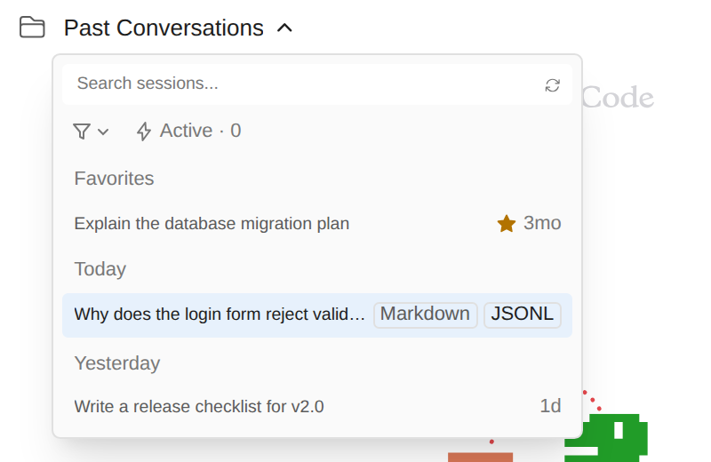

# /export로 세션 내보내기

> 언어: [English](./en.md) · **한국어**

터미널에서 `/export`는 대화를 파일로 저장합니다. GUI에서는 같은 명령이 *"/export isn't available in this environment"* 라고만 답했습니다. GUI는 CLI를 비대화형으로 실행하는데, CLI가 그 모드에서는 터미널 전용 명령을 거부하기 때문입니다. 이제는 GUI가 직접 내보내기를 하고, 세션 목록에서 지난 세션도 바로 내보낼 수 있습니다.

형식은 두 가지입니다.

| 형식 | 결과물 | 언제 쓰나 |
|------|--------|-----------|
| **Markdown** (`.md`) | 읽기 쉬운 대화 기록. 보낸 프롬프트와 슬래시 명령, Claude의 답변, 도구 호출과 그 결과(접혀 있음) | 대화를 공유하거나 이슈·문서에 붙여 넣을 때, 메모로 남길 때 |
| **JSONL** (`.jsonl`) | Claude Code CLI가 쓴 **세션 파일 원본 그대로**(바이트 단위로 동일) | 백업, 다른 컴퓨터로 세션 옮기기, 직접 만든 도구에 넣기 |

## 지금 대화 내보내기

채팅에 `/export`를 입력하고 Enter를 누르면 저장 대화상자가 열리고, 세션 제목으로 만든 파일 이름(`Fix-the-login-bug.md`)이 들어가 있습니다. 위치를 고르고 저장하면 화면 구석의 알림이 파일이 저장된 곳을 알려 줍니다.

명령에서 파일 이름을 바로 정할 수도 있습니다.

- `/export notes.md` — Markdown, `notes.md`로 제안
- `/export backup.jsonl`(또는 `.json`) — 원본 JSONL, `backup.jsonl`로 제안
- `/export notes` — 확장자가 없으면 Markdown으로 저장하고 `.md`를 붙입니다

입력한 내용에서는 파일 이름만 씁니다. `/export ../../somewhere/file.md` 같은 경로를 넣어도 저장 대화상자에는 `file.md`로 나오고, 폴더는 대화상자에서 고릅니다.

`/export`는 슬래시 명령 목록과 명령 팔레트에도 있고, 동작은 같습니다.

## 세션 목록에서 아무 세션이나 내보내기

세션 드롭다운(또는 세션 패널)을 열고 세션 위에 마우스를 올리면 이름 바꾸기·삭제 옆에 **내보내기** 아이콘(트레이로 들어가는 화살표)이 있습니다. 누르면 그 행에 두 형식이 나오고, **Markdown** 또는 **JSONL**을 누르면 됩니다.

마우스를 행 밖으로 옮기면 아무것도 내보내지 않고 원래 아이콘으로 돌아갑니다. 내보내기를 해도 세션이 열리지는 않습니다.

## Markdown에 들어가는 것

- 세션 제목(이름을 바꿨다면 그 이름)으로 된 제목, 이어서 세션 ID, 프로젝트 폴더, 내보낸 시각.
- 말하는 쪽이 바뀔 때마다 한 구역: 보낸 내용은 **User**, 답변은 **Claude**.
- 슬래시 명령은 실행한 명령 그대로(예: `` `/model opus` ``).
- 도구 호출은 **⏺ Bash(npm test)** 같은 한 줄과, 접을 수 있는 입력·결과 블록. 긴 입력과 결과는 잘라 내고 몇 글자가 빠졌는지 적어 둡니다.
- 첨부한 이미지와 문서는 *[image]*, *[document]*로 표시합니다.

화면에 보이는 대화를 따릅니다. 되감기나 포크 뒤에는 지금 가지만 들어갑니다. JSONL은 파일 전체라서 모든 가지가 남습니다.

일부러 빼는 것: Claude의 thinking(대화가 아니라 작업 메모)과 CLI가 스스로 넣는 텍스트(명령 출력 래퍼, 리마인더, "Request interrupted" 안내 등).

## 어디서 동작하나

저장 대화상자는 GUI가 실행되는 환경의 것을 씁니다. JetBrains IDE에서는 IDE 자체 대화상자, standalone 모드에서는 운영체제 대화상자(macOS Finder, Windows 대화상자, Linux `zenity`)입니다.

## 자주 묻는 질문

**`/export`를 입력했는데 아무 일도 없어요.** 저장 대화상자가 다른 창 뒤에 열렸거나 취소했을 수 있습니다. 취소는 잘못된 일이 아니라서 알림을 띄우지 않습니다.

**"Start a conversation before exporting it."이라고 나와요.** 아직 아무것도 보내지 않은 새 채팅이라 세션 파일이 없습니다. 먼저 메시지를 보내거나, 목록에서 지난 세션을 내보내세요.

**"This conversation has nothing to export yet."이라고 나와요.** 세션 파일은 있지만 대화 기록에 보여 줄 메시지가 없습니다.

**Linux에서 대화상자가 뜨지 않아요.** Linux의 standalone 모드는 저장 대화상자에 `zenity`를 씁니다. 패키지 관리자로 설치하세요(`sudo apt install zenity`, `sudo dnf install zenity`).

**터미널처럼 클립보드로 내보낼 수 있나요?** 아직은 안 됩니다. GUI는 항상 파일로 저장합니다.
