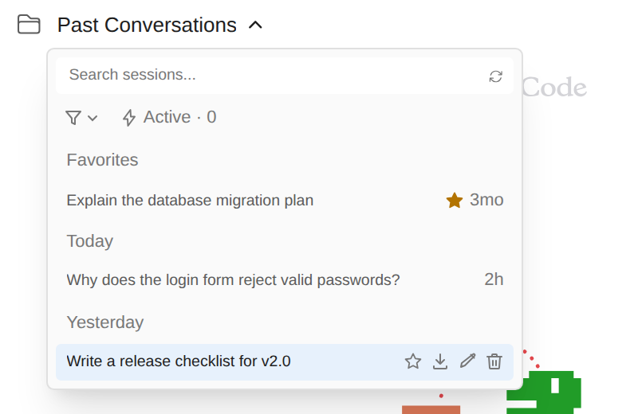

# 자주 돌아오는 세션에 별표 달기

> 언어: [English](./en.md) · **한국어**

몇 주씩 다시 찾는 대화가 있습니다. 설계를 정리한 대화, 릴리즈 체크리스트, 계속 이어 붙이는 디버깅 세션 같은 것들입니다. 세션 목록이 길어지면 이런 대화는 새 대화들 아래로 묻힙니다. 이제 **별표**를 달 수 있고, 별표한 세션은 목록 맨 위의 **Favorites** 그룹에 머뭅니다.

## 별표 달기

세션 드롭다운(또는 세션 패널)을 열고 세션 위에 마우스를 올리면, 그 행의 아이콘 중 첫 번째가 **별**입니다. 누르면 세션이 목록 맨 위 **Favorites**로 옮겨 가고, 그 행에는 시간 옆에 작은 채워진 별이 남습니다.

별표를 빼려면 세션에 다시 마우스를 올리고 채워진 별(툴팁 **Remove from favorites**)을 누르면 됩니다. 세션은 원래 날짜 그룹으로 돌아갑니다.

별표를 달아도 세션이 열리지 않고, 세션 자체에는 아무것도 바뀌지 않습니다.

## Favorites 그룹의 동작

- **항상 맨 앞입니다.** Today, Yesterday 등 모든 그룹보다 위에 있고, 그룹 안에서는 평소처럼 최신순입니다.
- **오래된 세션도 나옵니다.** 목록은 최근 세션을 한 페이지씩 불러오지만 별표한 세션은 따로 불러오므로, 몇 달 전에 별표한 세션도 목록을 열자마자 Favorites에 있습니다. 먼저 그 세션까지 스크롤할 필요가 없습니다.
- **검색과 필터가 그대로 적용됩니다.** 검색창에 입력하면 Favorites도 다른 그룹처럼 좁혀지고, Active·상태·탭 필터에 맞지 않는 별표 행은 숨겨집니다.
- **별표는 지금 보는 프로젝트를 따릅니다.** 다른 프로젝트에서 별표한 세션은 이 프로젝트 목록에 들어오지 않습니다. **하위 프로젝트 세션 포함**을 켜 두면 하위 폴더의 별표 세션도 다른 세션들처럼 함께 나옵니다.
- 목록의 **키보드 이동**도 보이는 순서대로 Favorites부터 지나갑니다.

## 모든 창이 같은 별표를 봅니다

별표는 모든 탭과 창이 공유합니다. 한 탭에서 별표를 달면 세션 패널과 다른 탭에도 곧바로 반영됩니다.

## 별표가 저장되는 곳

별표는 다른 GUI 설정과 같은 사용자 데이터 폴더의 `~/.claude-code-gui/session-favorites.json`에 저장됩니다. Claude Code CLI의 세션 파일에는 쓰지 않으므로 CLI에는 영향이 없고, 별표를 달아도 세션은 바뀌지 않습니다.

세션을 삭제하면 그 별표도 함께 지워집니다.

## 자주 묻는 질문

**별표를 달았더니 세션이 원래 자리에서 사라졌어요.** 맨 위의 Favorites 그룹으로 옮겨 갔습니다. 위로 스크롤해 보세요.

**세션을 지웠다 다시 만들었더니 별표가 없어요.** 별표는 세션 하나에 붙습니다. 세션을 지우면 별표도 지워집니다.

**터미널에서도 별표를 달 수 있나요?** 아니요. Claude Code CLI에는 즐겨찾기가 없습니다. CLI가 쓰는 세션 위에 GUI가 더한 편의 기능입니다.
