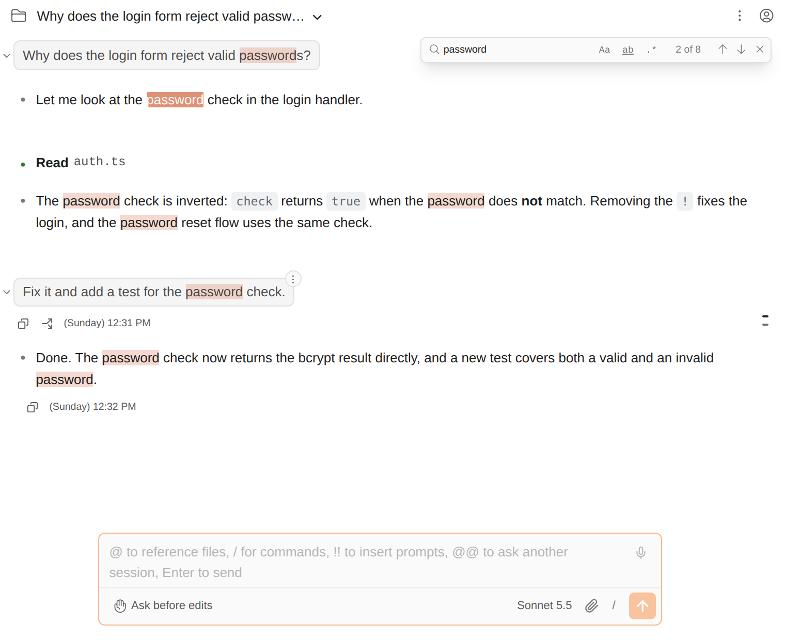

# Cmd/Ctrl+F로 대화 안에서 찾기

> 언어: [English](./en.md) · **한국어**

긴 세션은 스크롤로 찾기가 어렵습니다. 포트 번호가 리팩터링 전에 나왔는지 후에 나왔는지 같은 것 말입니다. 채팅에서 **Cmd+F**(macOS) 또는 **Ctrl+F**(Windows, Linux)를 누르면 대화 위에 검색창이 열리고, 일치하는 부분이 모두 강조되며 하나씩 건너갈 수 있습니다.

## 사용법

1. 채팅이 앞에 있을 때 **Cmd/Ctrl+F**를 누릅니다(또는 명령 팔레트에서 **Search in conversation**).
2. 입력합니다. 입력하는 대로 일치 항목이 강조되고, 첫 항목으로 스크롤되며, 카운터가 현재 위치를 보여줍니다(`2 of 8`).
3. **Enter**(또는 아래 화살표)는 다음 항목, **Shift+Enter**(또는 위 화살표)는 이전 항목으로 가고, 양 끝에서는 반대편으로 돌아갑니다. **F3** / **Shift+F3**도 됩니다.
4. **Esc** 또는 **×**를 누르면 검색창이 닫히고 강조도 사라집니다.

검색창이 열린 상태에서 다시 Cmd/Ctrl+F를 누르면 커서가 검색창으로 돌아가고 검색어가 선택되어, 바로 새로 입력할 수 있습니다.

## 옵션

| 토글 | 키 | 하는 일 |
|------|----|---------|
| **Aa** | Alt+C | 대소문자 구분: `Login`이 `login`을 찾지 않습니다 |
| **ab** | Alt+W | 단어 단위: `cat`이 `concat`을 찾지 않습니다 |
| **.\*** | Alt+R | 정규식: 검색어를 JavaScript 정규식으로 씁니다(`port \d+`) |

토글은 다음에도 기억됩니다. 컴파일되지 않는 정규식이면 개수 대신 **Invalid regex**가 나옵니다.

## 무엇을 찾나

- **보이는 대화**: 내 메시지, Claude의 답변, 도구 카드의 글자.
- 입력창·버튼·메뉴는 **찾지 않습니다**.
- **불러와서 화면에 보이는 것만** 찾습니다. 긴 세션은 위로 스크롤할 때 이전 메시지를 불러오고, 접힌 답변과 접힌 도구 카드는 숨겨져 있습니다. 그 안의 글자는 화면에 나오기 전까지 찾지 못합니다. 이전 메시지를 불러오거나 답변을 펼치면 검색이 저절로 다시 반영합니다.
- 아직 스트리밍 중인 답변도 따라갑니다. 새 글자가 오는 대로 검색하되, 보고 있던 항목에서 화면을 옮기지 않습니다.

서식을 넘나드는 일치는 찾지 못합니다. `**foo**bar`에서 `foobar`를 찾으면 두 부분이 따로 그려지므로 결과가 없습니다.

## 어디서 동작하나

채팅이 실행되는 모든 곳입니다. JetBrains IDE에서는 채팅에 포커스가 있는 동안 Cmd/Ctrl+F가 뒤의 에디터에 대한 IDE 찾기 대신 채팅의 것이 됩니다(Cmd/Ctrl+Shift+F, 파일에서 찾기는 그대로입니다). standalone 모드의 브라우저에서는 채팅 페이지에서 브라우저 자체 찾기 대신 이 검색창이 열립니다.

macOS에서 Ctrl+F는 텍스트 입력란에서 계속 Emacs식 "한 글자 앞으로" 키이고, 검색은 Cmd+F입니다.

## 자주 묻는 질문

**카운터에는 결과가 있는데 강조가 안 보여요.** 강조에는 최근 브라우저 엔진이 필요합니다(Chrome/Edge 105+, Safari 17.2+, Firefox 140+). JetBrains IDE에는 들어 있습니다. 오래된 브라우저에서도 개수 세기와 이동은 되고, 색칠만 빠집니다.

**분명히 있는 내용을 못 찾아요.** 아직 불러오지 않은 이전 페이지, 접힌 답변, 접힌 도구 카드 안에 있을 가능성이 큽니다. 위로 스크롤해 이전 메시지를 불러오거나 카드를 펼친 뒤 다시 찾아보세요.

**Cmd/Ctrl+F를 누르면 IDE 찾기가 열려요.** 먼저 채팅을 클릭해 포커스를 주세요.
