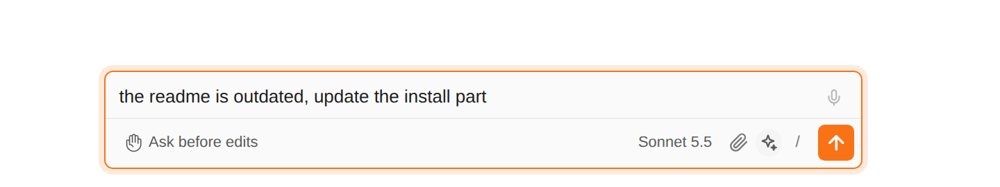
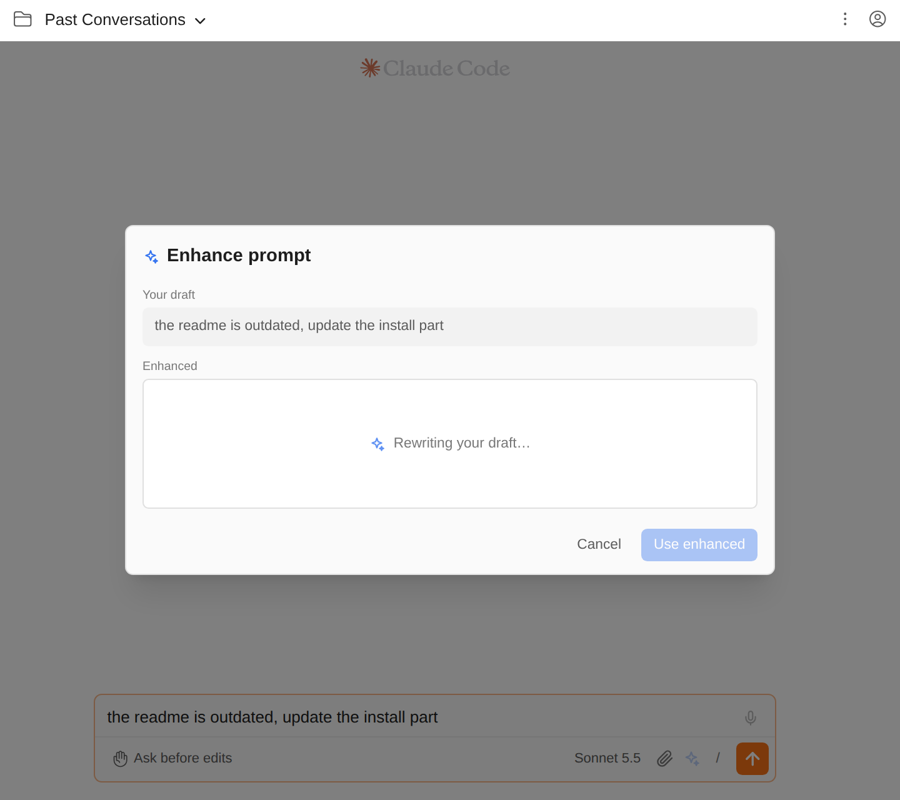
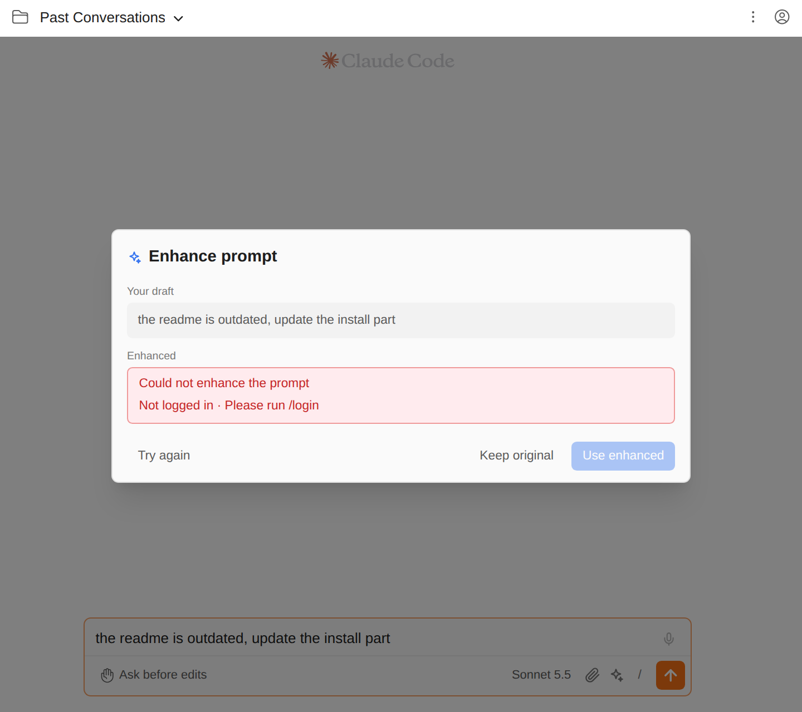

# Turn a rough draft into a clear prompt

> Language: **English** · [한국어](./ko.md)

A prompt typed in a hurry ("the readme is outdated, update the install part") usually works, but Claude has to guess at the rest: which section, how to check, what not to touch. The **enhance** button next to the attach button rewrites your draft into a clearer prompt before you send it. You see the draft and the rewrite side by side, edit the rewrite if you like, and decide which one goes in the composer. Nothing is sent until you send it.

## Using it

1. Type your draft in the composer.
2. Click the **sparkle** button in the composer's bottom bar (tooltip **Enhance prompt**). It is greyed out while the composer is empty.
3. A dialog opens with your draft at the top and **Rewriting your draft…** below it. A short draft usually takes a few seconds.
4. When the rewrite arrives it appears in an editable box, with the caret at the end. Change anything you like.
5. Pick one:
   - **Use enhanced** (or **Cmd/Ctrl+Enter**) replaces the draft in the composer with the text in the box. The composer is not sent; read it and send it as usual.
   - **Keep original** (or **Esc**, or a click outside the dialog) closes the dialog and leaves your draft exactly as it was.
   - **Try again** asks for a new rewrite of the same draft.

Plain **Enter** inside the rewrite starts a new line, so you can edit freely; it is Cmd/Ctrl+Enter that takes the rewrite.

**Use enhanced can be undone.** The draft is replaced the same way typing replaces it, so one **Cmd/Ctrl+Z** in the composer gives your original draft back.

## What the rewrite does

The rewrite keeps your intent and tries to make it easier to act on:

- vague references ("this", "this file") become names, using the file you have open in the editor;
- it adds the details an engineer would ask for: expected behaviour, what not to change, how to check the result;
- it fixes typos and grammar;
- it stays short for a short draft, and it is written **in the language of your draft**.

It does not answer or carry out your request, does not paste your code into the prompt (it refers to it by file and line instead), and does not add goals you did not ask for. A model can still get this wrong, which is why you always see the result before it reaches the composer.

## What it sees

- **Your draft**, exactly as typed. If the draft is addressed to another session with an `@@` chip, the chip is left out of the rewrite and put back in front of it when you use it.
- **The file and selection open in your editor**, but only while the editor-context tag next to the mode selector is on (the file icon, not the crossed-out eye). It is the same switch that decides whether your next message carries that file, so turning the tag off keeps the editor out of the rewrite too. A selection longer than 4,000 characters is cut, and the rewrite is told how much was left out.

It does not see the conversation so far.

## Which model writes it

The model shown in the composer (**Sonnet 5.5** in the screenshots). The rewrite comes from the model you are already talking to, and it is billed to the same account, like any other request.

## How it works

The GUI runs the same command a terminal user would: one `claude -p` call, with the draft on standard input. It is a plain question and answer, not a session:

- it is not saved and does not appear in your session list (`--no-session-persistence`);
- it has no tools (`--tools ""`), so it cannot read, edit or run anything in your project;
- it starts no MCP servers (`--strict-mcp-config`) and runs no skills (`--disable-slash-commands`);
- your hooks do not fire for it (`disableAllHooks`), so a Stop hook that plays a sound or a UserPromptSubmit hook that adds context does not run for a rewrite;
- the agent system prompt is replaced by the rewriting instructions (`--system-prompt-file`).

Because it is the CLI, it uses your Claude login and settings for this project, works the same in a JetBrains IDE and in the browser (standalone mode), and depends on no SDK.

## Limits

- At most **20,000 characters** per draft. A longer one shows "The draft is too long to enhance".
- A rewrite gives up after **two minutes**. If the network is down, the CLI retries for that long before it gives up, so a dialog that keeps saying "Rewriting your draft…" for a minute or more usually means the API cannot be reached. **Cancel** closes it at any time; your draft is never touched until you pick **Use enhanced**.
- Attachments (images, files) are not part of the rewrite and are not changed by it.

## Common questions

**The sparkle button is grey.** The composer is empty, or holds only attachments or an `@@` chip. Type some words first.

**"Could not enhance the prompt" with a message below it.** The message is the CLI's own, unchanged: for example "Not logged in · Please run /login" means the Claude login for this project has expired, and a quota or network message means the same thing it would in the terminal. Fix the cause and press **Try again**.

**"The model returned nothing to use."** The answer was empty once the model's own wrappers ("Here is the improved prompt:", a code fence around everything) were removed. Press **Try again**.

**The rewrite answered my question instead of rewriting it.** It is told not to, but a model can still slip, especially with a draft that is itself a short question. Press **Try again**, or keep your original.

**Does it cost anything?** It is one ordinary request to the model shown in the composer, counted against your account like any other message. A short draft is a small request.

**Can I enhance from the keyboard?** Not yet. In the dialog, Cmd/Ctrl+Enter takes the rewrite and Esc closes it.
