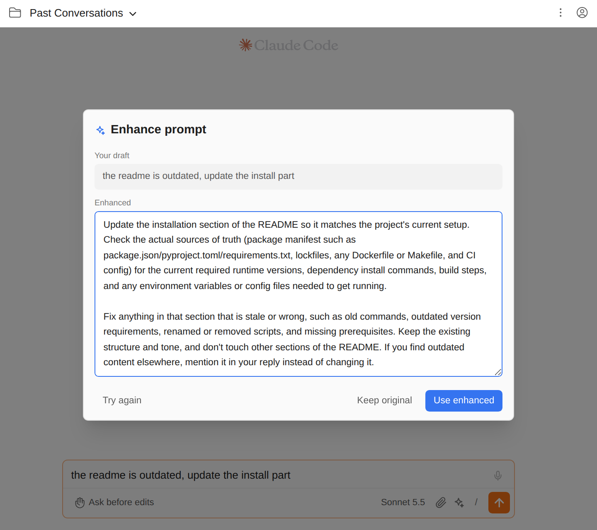

# 대충 쓴 초안을 분명한 프롬프트로

> 언어: [English](./en.md) · **한국어**

급하게 쓴 프롬프트("the readme is outdated, update the install part")도 대개 통하지만, 나머지는 Claude가 짐작해야 합니다. 어느 섹션인지, 무엇으로 확인할지, 무엇은 건드리지 말지 같은 것들입니다. 첨부 버튼 옆의 **다듬기** 버튼은 보내기 전에 초안을 더 분명한 프롬프트로 고쳐 씁니다. 초안과 고친 글을 나란히 보고, 원하면 고친 글을 손본 뒤, 어느 쪽을 입력창에 둘지 직접 고릅니다. 직접 보내기 전에는 아무것도 전송되지 않습니다.

## 사용법

1. 입력창에 초안을 씁니다.
2. 입력창 아래 바의 **반짝이** 버튼을 누릅니다(툴팁 **Enhance prompt**). 입력창이 비어 있으면 흐리게 꺼져 있습니다.
3. 대화상자가 열리고, 위에는 초안이, 아래에는 **Rewriting your draft…**가 나옵니다. 짧은 초안은 보통 몇 초면 됩니다.
4. 고친 글이 오면 편집할 수 있는 칸에 들어가고, 커서는 맨 끝에 있습니다. 원하는 대로 고치세요.
5. 하나를 고릅니다.
   - **Use enhanced**(또는 **Cmd/Ctrl+Enter**): 입력창의 초안을 칸 안의 글로 바꿉니다. 전송은 하지 않으니, 읽어 보고 평소처럼 보내면 됩니다.
   - **Keep original**(또는 **Esc**, 대화상자 바깥 클릭): 대화상자를 닫고 초안을 그대로 둡니다.
   - **Try again**: 같은 초안을 다시 고쳐 씁니다.

고친 글 안에서 그냥 **Enter**는 줄바꿈이라 자유롭게 고칠 수 있습니다. 고친 글을 가져가는 키는 Cmd/Ctrl+Enter입니다.

**Use enhanced는 되돌릴 수 있습니다.** 타이핑과 같은 방식으로 초안을 바꾸므로, 입력창에서 **Cmd/Ctrl+Z**를 한 번 누르면 원래 초안으로 돌아옵니다.

## 무엇을 고쳐 주나

의도는 그대로 두고, 바로 실행할 수 있게 만드는 쪽으로 고칩니다.

- "이거", "이 파일" 같은 모호한 말을 에디터에 열린 파일을 보고 이름으로 바꿉니다.
- 엔지니어가 물어볼 만한 것을 더합니다. 기대 동작, 바꾸지 말 것, 결과 확인 방법 등입니다.
- 오타와 문법을 고칩니다.
- 짧은 초안은 짧게 두고, **초안과 같은 언어**로 씁니다.

요청에 답하거나 그 일을 대신 하지 않습니다. 코드를 프롬프트에 붙여 넣지 않고(파일과 줄로 가리킵니다), 요청하지 않은 목표를 더하지 않습니다. 그래도 모델은 틀릴 수 있어서, 결과는 언제나 입력창에 들어가기 전에 먼저 보여 줍니다.

## 무엇을 보고 고치나

- **초안**: 쓴 그대로입니다. `@@` 칩으로 다른 세션에 보내는 초안이면 칩은 빼고 고치고, 쓸 때 칩을 다시 앞에 붙입니다.
- **에디터에 열린 파일과 선택 영역**: 모드 선택 옆의 에디터 컨텍스트 태그가 켜져 있을 때만입니다(줄 그은 눈이 아니라 파일 아이콘일 때). 다음 메시지에 그 파일을 실을지 정하는 것과 같은 스위치라서, 태그를 끄면 다듬기에도 에디터 내용이 들어가지 않습니다. 4,000자가 넘는 선택은 잘라 내고, 얼마나 잘렸는지 함께 알려 줍니다.

지금까지의 대화는 보지 않습니다.

## 어떤 모델이 쓰나

입력창에 표시된 모델입니다(스크린샷에서는 **Sonnet 5.5**). 지금 대화하는 모델이 고쳐 쓰고, 다른 요청과 똑같이 같은 계정으로 청구됩니다.

## 어떻게 동작하나

GUI는 터미널 사용자가 쓰는 것과 같은 명령을 실행합니다. 초안을 표준 입력으로 넘기는 `claude -p` 호출 한 번이며, 세션이 아니라 질문 하나와 답 하나입니다.

- 저장되지 않고 세션 목록에도 나오지 않습니다(`--no-session-persistence`).
- 도구가 없습니다(`--tools ""`). 프로젝트의 파일을 읽거나 고치거나 실행할 수 없습니다.
- MCP 서버를 띄우지 않고(`--strict-mcp-config`) 스킬을 실행하지 않습니다(`--disable-slash-commands`).
- 훅이 실행되지 않습니다(`disableAllHooks`). 소리를 내는 Stop 훅이나 컨텍스트를 덧붙이는 UserPromptSubmit 훅이 다듬기 때마다 돌지 않습니다.
- 에이전트용 시스템 프롬프트 대신 고쳐 쓰기 지침을 씁니다(`--system-prompt-file`).

CLI를 그대로 쓰므로 이 프로젝트의 Claude 로그인과 설정을 따르고, JetBrains IDE와 브라우저(standalone 모드)에서 똑같이 동작하며, SDK에 기대지 않습니다.

## 한계

- 초안은 **최대 20,000자**입니다. 더 길면 "The draft is too long to enhance"가 나옵니다.
- 다듬기는 **2분**이 지나면 포기합니다. 네트워크가 끊겨 있으면 CLI가 그동안 재시도하므로, "Rewriting your draft…"가 1분 넘게 계속되면 대개 API에 닿지 못하는 상황입니다. **Cancel**로 언제든 닫을 수 있고, **Use enhanced**를 누르기 전까지 초안은 건드리지 않습니다.
- 첨부(이미지·파일)는 다듬기에 들어가지 않고, 다듬기로 바뀌지도 않습니다.

## 자주 묻는 질문

**반짝이 버튼이 회색이에요.** 입력창이 비어 있거나, 첨부나 `@@` 칩만 있는 상태입니다. 먼저 글을 쓰세요.

**"Could not enhance the prompt" 아래에 메시지가 떠요.** 아래 메시지는 CLI가 낸 그대로입니다. 예를 들어 "Not logged in · Please run /login"은 이 프로젝트의 Claude 로그인이 만료됐다는 뜻이고, 사용량이나 네트워크 메시지도 터미널에서와 같은 뜻입니다. 원인을 해결한 뒤 **Try again**을 누르세요.

**"The model returned nothing to use."가 나와요.** 모델이 덧붙인 포장("Here is the improved prompt:", 전체를 감싼 코드 블록)을 걷어 내고 나니 남은 글이 없었습니다. **Try again**을 누르세요.

**고쳐 쓰는 대신 질문에 답해 버렸어요.** 그러지 말라고 지시하지만, 초안이 짧은 질문일 때 특히 모델이 어긋날 수 있습니다. **Try again**을 누르거나 원래 초안을 쓰세요.

**비용이 드나요?** 입력창에 표시된 모델에 보내는 평범한 요청 하나이며, 다른 메시지처럼 계정 사용량에 들어갑니다. 짧은 초안은 작은 요청입니다.

**키보드로 다듬을 수 있나요?** 아직은 안 됩니다. 대화상자 안에서는 Cmd/Ctrl+Enter로 고친 글을 가져가고 Esc로 닫습니다.
