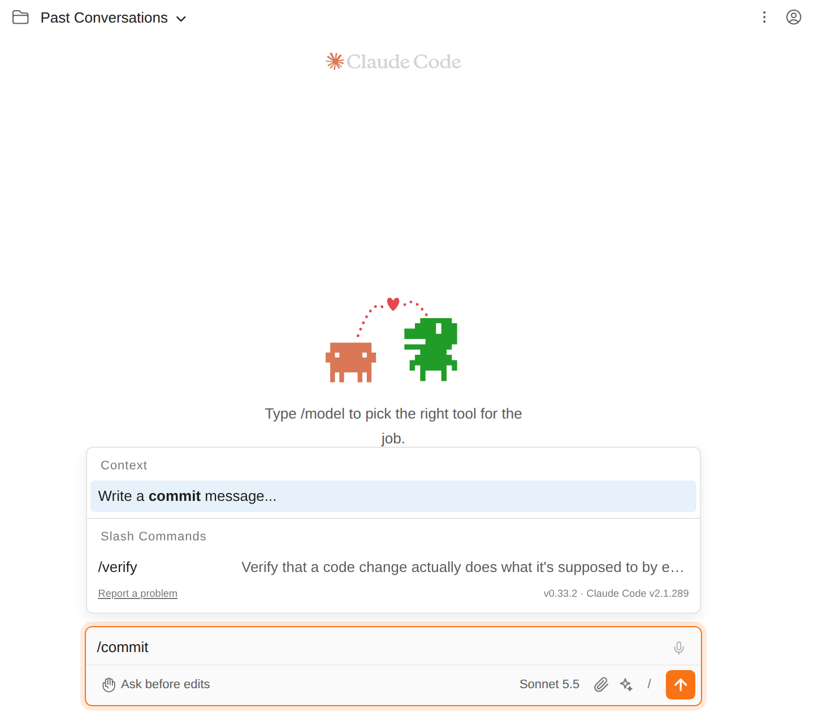
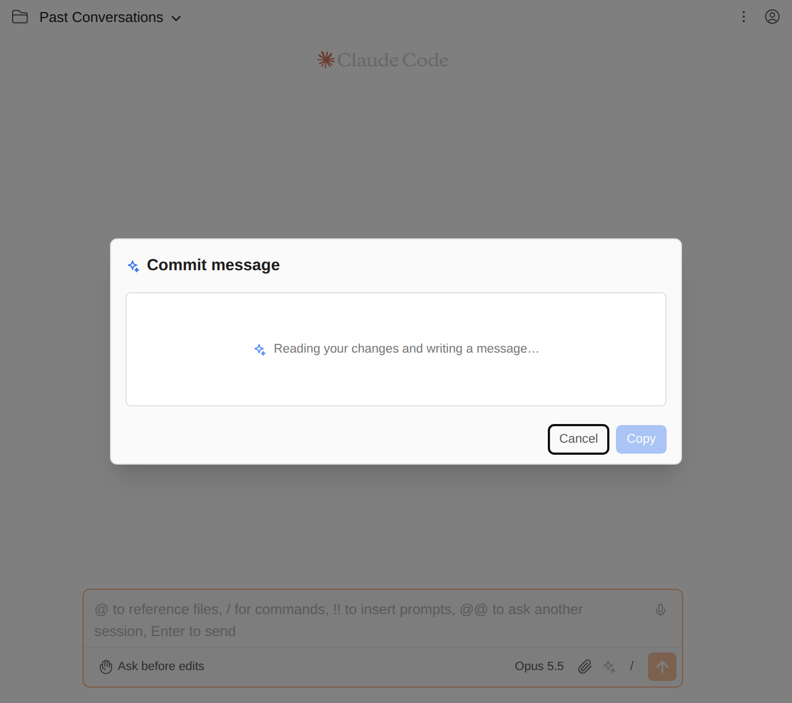

# Let Claude write the commit message

> Language: **English** · [한국어](./ko.md)

Writing a good commit message for a change you just finished is a chore, and "fix stuff" is what it turns into at the end of a long day. Claude can read the change and write the message for you: in a JetBrains IDE from a button in the commit dialog, and anywhere (including the browser in standalone mode) from the command palette. Claude only writes. Committing stays yours.

## In a JetBrains IDE: the commit dialog

1. Open the commit tool window (or the Commit dialog) as usual and tick the changes you want to commit.
2. In the toolbar of the commit message box, click **Generate Commit Message with Claude** (the Claude Code icon).
3. The box shows "Writing a commit message with Claude…" while Claude works, then the message.
4. Read it, change what you like, and commit as usual.

What Claude describes is exactly what is ticked: the files included in the commit, both sides of a renamed file, and ticked unversioned files. If you already typed a few words in the box, they are sent along as a draft, and Claude keeps what they say and builds the message around them.

If writing fails, your draft is put back in the box and a notification says why (the message is the CLI's own: for example "Not logged in · Please run /login"). If the box's text cannot be read in your IDE version, it is left untouched while Claude writes, so a failure never loses what you typed.

Clicking the button again while Claude is still writing starts over; only the newest answer lands in the box.

## Anywhere: the command palette

In standalone mode there is no commit dialog, so the same writer is in the command palette:

1. Type `/commit` in the composer (or open the palette from the `/` button) and pick **Write a commit message...**.
2. A dialog writes a message for the project the chat is in.
3. Edit it if you like, then **Copy** (or **Cmd/Ctrl+Enter**) puts it on the clipboard. **Write again** asks for a new one.

Which changes the palette describes is what `git commit` would commit right now:

- **When something is staged**, only the staged changes ("For the staged changes, as git commit would commit them.").
- **When nothing is staged**, every uncommitted change, untracked files included ("For all uncommitted changes (nothing is staged), untracked files included.").

The dialog does not commit, stage or change anything. Commit the way you always do: in a terminal, in your Git client, or by asking Claude in the chat.

## What the message looks like

- A subject line in the imperative mood ("Fix", not "Fixed"), at most 72 characters.
- When the change has more than one part, a blank line and short bullets saying what changed and why, naming the main files.
- **Your repository's style.** Claude is shown the last ten commit subjects and follows their language, prefixes (`feat:`, `fix(api):`), capitalisation and tone. A repository that writes Korean subjects gets a Korean message; one that uses Conventional Commits gets one. With no history yet, the message is a plain English subject.
- **Your project's rules.** Like every `claude` command, this one reads the project's `CLAUDE.md`. If it says how commit messages are written ("subjects in Korean", "always include the ticket number"), Claude follows that over everything above.
- No "Generated with" or "Co-Authored-By" lines.

## What Claude sees

- The diff of the changes being described (against the last commit), plus a short summary of every changed file (`git diff --stat`).
- The content of new, untracked files, up to 4,000 characters each. Binary files are named, not pasted.
- The last ten commit subjects.

A large change is cut down to about 60,000 characters before it is sent: each file gets a share, so one big lockfile cannot push the rest out, and the summary still names every file. Claude does not see the chat, and it cannot run anything: the call has no tools.

## Projects with several repositories

An IntelliJ project can hold several Git repositories (they show up as separate VCS roots in one commit dialog). The button sorts the ticked files by repository and describes them together, each under its repository's name. The style comes from the repository with the most files in the commit. The palette, which has no dialog to tick files in, uses the repository the chat's project folder is in.

## How it works

The diff comes from `git` itself, and the message from one `claude -p` call, which is what a terminal user gets by piping `git diff` into `claude -p`. Like the [prompt enhancer](../083-prompt_enhancer/en.md), the call is a single question and answer: no tools, no MCP servers, no skills, no hooks, nothing saved to your session list. It uses your Claude login for the project and the model shown in the composer (the IDE button uses your default model). The IDE button and the palette end in the same backend code, so they write the same kind of message.

## Limits

- Git only.
- Writing gives up after two minutes; with no network the CLI keeps retrying until then.
- In the IDE, a commit with so many files that their paths do not fit in one request (tens of thousands of characters of paths) is described the way the palette does it: staged changes, or all of them.

## Common questions

**"There is nothing to commit in this project."** The palette found no staged and no uncommitted changes. In the IDE the same message means none of the ticked files differs from the last commit.

**"This project is not a Git repository."** The project folder (or, from the IDE, the ticked files) is not inside a Git repository.

**The message has a "Co-Authored-By" line.** It should not: Claude is told not to add one. If it keeps happening, check whether your project's `CLAUDE.md` asks for it, since that file wins.

**It wrote in the wrong language.** It follows your recent subjects. With no history yet it writes English; say what you want in `CLAUDE.md` ("Write commit messages in Korean."), and it will follow that.

**Does it cost anything?** It is one request to the model, counted against your account like any other message. Large diffs are larger requests, which is why they are cut down.

**Can it commit for me?** No. It writes the message and stops. To have Claude commit, ask it in the chat.
