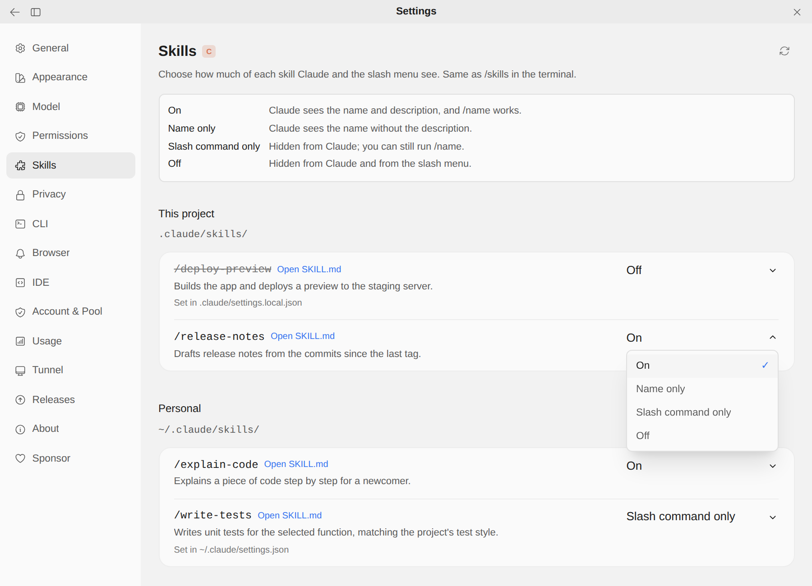

# Claude가 볼 스킬 고르기

> 언어: [English](./en.md) · **한국어**

스킬은 작업에 필요할 때 Claude가 불러오는 지침 폴더입니다. 설치한 스킬은 모두 모델에게 목록으로 알려지는데, 목록이 길면 컨텍스트를 차지하고 엉뚱한 스킬로 끌려가기도 합니다. 터미널에서는 `/skills`로 스킬마다 노출 정도를 줄일 수 있지만, GUI에는 방법이 없었습니다. `/skills`가 터미널 화면이기 때문입니다. 이제 **설정 → 스킬**이 같은 설정으로 같은 일을 합니다.

## 사용법

1. **설정 → 스킬**을 엽니다.
2. 스킬은 `/이름`과 설명으로 보이고, 있는 곳에 따라 나뉩니다.
   - **이 프로젝트**: 지금 프로젝트의 `.claude/skills/<이름>/SKILL.md`.
   - **개인**: 모든 프로젝트에서 쓰는 `~/.claude/skills/<이름>/SKILL.md`.
3. 스킬 옆 드롭다운에서 상태를 고릅니다. 바로 저장되며 저장 버튼은 없습니다.

이름 옆의 **Open SKILL.md**를 누르면 그 스킬 파일이 에디터(IDE)에서 열려 내용을 읽거나 고칠 수 있습니다. 스킬이 여섯 개를 넘으면 이름이나 설명으로 좁히는 검색창이 생깁니다.

## 네 가지 상태

| 상태 | Claude가 보는 것 | `/이름`으로 실행 |
|------|------------------|------------------|
| **On** | 이름과 설명. Claude가 스스로 꺼내 쓸 수 있습니다 | 됨 |
| **Name only** | 설명 없이 이름만. 컨텍스트를 아낍니다 | 됨 |
| **Slash command only** | 아무것도 못 봅니다. Claude가 먼저 꺼내지 않습니다 | 됨 |
| **Off** | 아무것도 못 봅니다 | 안 됨. 슬래시 메뉴에서도 빠집니다 |

CLI의 `skillOverrides` 설정이 받는 네 값(`on`, `name-only`, `user-invocable-only`, `off`) 그대로입니다. 그래서 여기서 끈 스킬은 터미널에서도 꺼져 있고, 그 반대도 마찬가지입니다. 끈 스킬을 이름으로 실행하면 CLI가 직접 답합니다: *"Skill "…" is disabled via skillOverrides."*

## 어디에 저장되나

스킬 폴더는 아무것도 바뀌지 않습니다. 상태는 `/skills`가 쓰는 것과 같은 설정 파일에 들어갑니다.

- **프로젝트** 스킬: 프로젝트의 `.claude/settings.local.json`(내 것이며 커밋하지 않는 파일)
- **개인** 스킬: `~/.claude/settings.json`

그 스킬의 `skillOverrides` 항목만 고치고 파일의 다른 내용은 그대로 둡니다. **On**으로 되돌리면 "on"을 적는 대신 항목을 지웁니다. 항목이 없으면 원래 켜진 것이기 때문입니다.

설정 파일이 상태를 정하고 있으면 그 줄에 **Set in …**이 붙어 출처를 알려 줍니다. 팀이 공유하는 `.claude/settings.json`이 스킬을 꺼 두었다면, 여기서 바꾼 값은 내 `.claude/settings.local.json`에 들어가 나에게만 공유 파일보다 우선합니다. 공유 파일은 절대 고치지 않습니다.

상태를 정하는 파일이 기본 위치와 다르면(예: 개인 스킬을 이 프로젝트의 `.claude/settings.local.json`에서 꺼 둔 경우) 그 파일을 고쳐서 바꾼 값이 실제로 적용되게 합니다.

## 언제 적용되나

Claude가 설정을 다시 읽을 때, 즉 다음 메시지를 보낼 때입니다. 슬래시 메뉴는 열 때마다 명령 목록을 다시 읽으므로, 끈 스킬은 재시작 없이 메뉴에서 빠지고 켜면 다시 나타납니다.

## 한계

- 개인 스킬과 프로젝트 스킬만 보여 줍니다. 플러그인에 딸린 스킬과 Claude Code 내장 스킬은 여기 나오지 않으니 터미널의 `/skills`에서 관리하세요.
- 여기서 스킬을 만들거나 이름을 바꾸거나 지우지는 않습니다. 두 위치 중 한 곳에 `SKILL.md`가 든 폴더를 넣거나 빼고, 오른쪽 위 다시 읽기 버튼을 누르세요.
- 이름은 스킬 frontmatter의 `name:`이고, 없으면 폴더 이름입니다. CLI와 같은 규칙입니다.

## 자주 묻는 질문

**내 스킬이 목록에 없어요.** 이 프로젝트의 `.claude/skills/`나 `~/.claude/skills/` 아래에 있는 폴더이고, 그 안에 이름이 정확히 `SKILL.md`인 파일이 있는지 확인한 뒤 다시 읽기 버튼을 누르세요.

**Off로 했는데 Claude가 계속 썼어요.** 바꾼 값은 다음 메시지부터 적용됩니다. 이미 답하고 있던 메시지는 시작할 때의 목록을 그대로 씁니다.

**"Set in .claude/settings.json"이라고 나오는데 그런 걸 쓴 적이 없어요.** 팀의 누군가가 쓴 것입니다. 그 파일은 프로젝트와 함께 공유됩니다. 여기서 고른 값은 `.claude/settings.local.json`에 저장되어 그들 것을 바꾸지 않고 나에게만 우선합니다.

**프로젝트가 꼭 있어야 하나요?** 개인 스킬은 어디서든 관리할 수 있습니다. 프로젝트 스킬은 그 프로젝트를 열어야 합니다.
