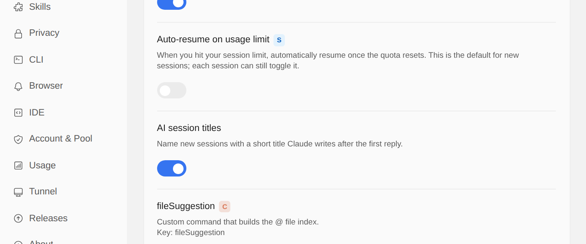

# Sessions get a short title of their own

> Language: **English** · [한국어](./ko.md)

A session used to be listed under its whole first prompt: "hey so the signup page lets people register with an empty email and the error text…", cut off wherever the row ran out of room. Ten such rows in a list all start the same way and say little about what happened in them.

Now a new session gets a short title once its first reply is finished. Claude reads your first message and names the session in a few words, in the language you wrote in.


Ported from the CC GUI plugin, which names its sessions the same way.

## When a session gets a title

- **After the first reply of a new session.** The title arrives a few seconds after the reply ends and replaces the first prompt in the header and in the session dropdown. You do not need to reload anything.
- **Once.** A session is named one time. Later messages do not change the title.
- **Only new sessions.** A session you started before this release, or one you open from the list and continue, keeps the name it has. Nothing goes back and renames your history.
- **Only if the first reply succeeded.** If the first turn ends in an error, the session waits and is named after the first reply that succeeds.
- **Not when the first message is a slash command.** A session that starts with `/init` is called "/init", which already says what it is.
- **A forked conversation** keeps the title of the session it was forked from, because it begins with the same message.

## A name you choose always wins

The generated title never covers a name someone chose:

| Name | Where it comes from | Ranks |
|------|---------------------|-------|
| Your rename in the session dropdown | This app | First |
| `--name` | Starting `claude` with a session name | Second |
| `/rename` | The CLI command, here or in a terminal | Third |
| A title Claude Code generated itself | The CLI, for some sessions it runs | Fourth |
| **The generated title** | This feature | Same place as the one above, used when there is none |
| A summary | Written by the CLI when a long conversation is compacted | Next |
| The first prompt | What you typed | Last |

If you rename a session while its title is still being written, your name is kept and the generated one is thrown away.

This is the same order `claude --resume` uses to name sessions in the terminal. The list now also shows the titles the CLI generates itself (its `ai-title` entries, which it writes for some of the sessions it runs itself); before this release those were ignored and the first prompt was shown instead.

## Turning it off

**Settings → General → AI session titles.** It is on by default. Switching it off stops new sessions from being named; titles already written stay. Like the other settings on that page, it can be set for one project only.



## How it works

The title is written by one short call to the official CLI, the same way the prompt enhancer and the commit message writer work:

```
claude -p --model haiku --no-session-persistence --tools "" …
```

- **Model:** Haiku, the small fast model, so naming costs a fraction of the reply it follows. If your provider maps Haiku to another model (`ANTHROPIC_DEFAULT_HAIKU_MODEL`), that one is used, as in the CLI.
- **What Claude reads:** the first 1,000 characters of your first message, and nothing else. The call runs outside your project, so it does not read the project's `CLAUDE.md` either; naming does not need it, and a large one would be paid for on every new session.
- **Account:** the same one the chat uses, including a login made with `claude /login`. No API key is needed.
- **No session is recorded** for the naming call (`--no-session-persistence`), so it does not appear in your session list or in `claude --resume`.

## Where the title is kept

In the app's own data files, in your user data folder:

```
~/.claude-code-gui/entities/session/session_ai_titles.entity.jsonl
```

Each line is one title: the session's id, the title, when it was stored, and the number of the project the session runs in. If you set `CCG_HOME`, the folder follows it. **Your transcripts are not changed**: the title is not written into the session's `.jsonl` file. That also means a title generated here shows in this app but not in `claude --resume`; a name you want everywhere is best given with `/rename`. (The renames you make in the session dropdown are kept apart from these, in `.claude-code-gui-session-titles.json` beside your sessions.)

Deleting a session from the list removes its title too.

**Titles from an earlier version are kept.** Earlier builds kept them in `~/.claude/projects/<project>/.claude-code-gui-ai-titles.json`. The first start of this version moves them into the file above and leaves the old files as they were. A title the move cannot read is skipped rather than reported: the session then shows its first prompt, as it did before it had a title.

## Limits

- **It costs a small amount of usage** per new session: one Haiku call with your first message. Turn the setting off if you would rather not spend it.
- **It needs the model to answer.** If the call fails (no network, an expired login, a provider without Haiku), the session simply keeps its first prompt as its name. The failure is logged and not shown, since nothing is lost.
- **The title is only as good as the first message.** A session that starts with "hi" gets a title about a greeting. Rename it from the session dropdown whenever you like.

## Common questions

**My old sessions still show their first prompt.** Only sessions started from now on are named. Rename an old one from the session dropdown if you want a better name.

**The title is in the wrong language.** It follows the language of your first message. If you wrote in one language and want another, rename the session.

**Can I get the title in the terminal too?** Not from this feature, since it does not edit the transcript. `/rename <name>` in the chat sets a name the CLI reads as well.

**Why did a session I named with `/rename` not get a generated title?** Because you already named it. A name you choose is never replaced.
