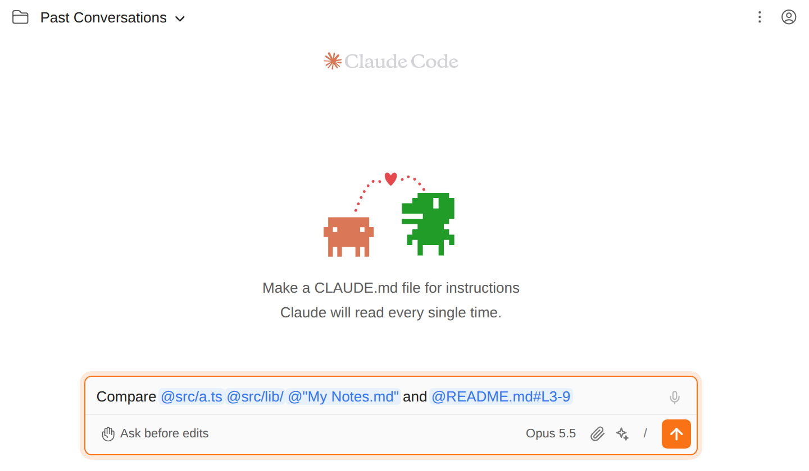
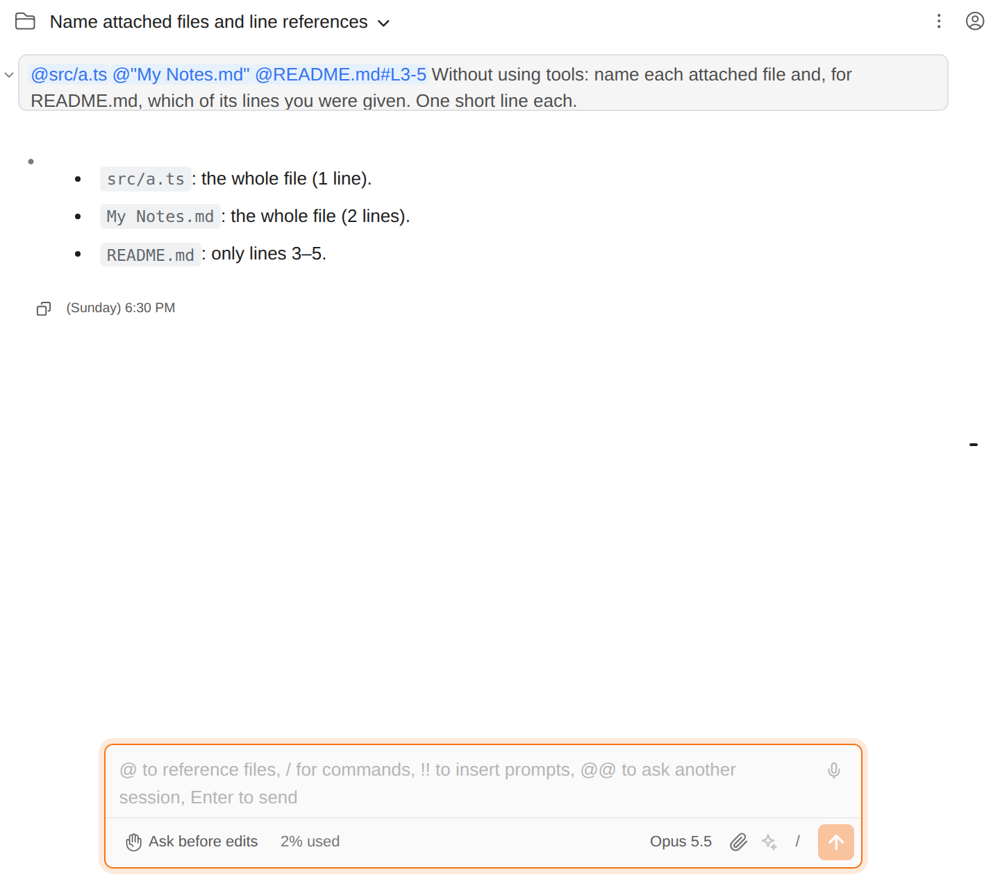

# Send files and folders to Claude from the project view

> Language: **English** · [한국어](./ko.md)

**Send to Claude Code** (Alt+K) has long put the file you are editing into the chat input as an `@` mention. Now the same item is in two more menus, so you can hand Claude files without opening them first:

- **the project view**: right-click one or more files or folders;
- **an editor tab**: right-click the tab's title.

Pick several files and folders at once (Ctrl/Cmd-click or Shift-click in the project view) and they all go in together. Ported from the CC GUI plugin, which has the same item.

This release also fixes the line range that Alt+K writes. Before, a selection of lines 3 to 9 was written as `@README.md#L3-L9`, which the CLI does not read as a range, and Claude received the **whole file**. It is now written as `@README.md#L3-9`, so Claude gets just those lines (see [below](#the-line-range-fix)).

## What goes into the input

| You pick | It is written as |
|----------|------------------|
| A file | `@src/a.ts` |
| A folder | `@src/lib/`, with a trailing slash like the CLI's own `@` completion |
| The project folder itself | `@./` |
| A file whose path has a space | `@"My Notes.md"`, the quoted form the CLI reads |
| A file outside the project | its absolute path |
| Several of these | all of them, in the order you picked, separated by spaces |

Paths are relative to the project. The mentions are added where the caret is, after anything you already typed, and the input gets focus, the same way Alt+K works. **Nothing is sent**: you add your question and press Enter yourself.

The mentions are ordinary `@` mentions. When you send, the Claude Code CLI reads them exactly as if you had typed them in the terminal: a file's contents are attached, and a folder is listed.

## Which chat it goes to

The same one Alt+K picks: the Claude Code panel you used last. If that is a browser tab in standalone mode, the mentions go there and the IDE stays as it is. If no chat is open, a new Claude Code tab opens with the mentions in its input.

## The line-range fix

The Claude Code CLI recognises a line range in a mention as `#L<start>-<end>`. Alt+K used to write `#L<start>-L<end>`, with a second `L`. The CLI does not match that pattern; it then attached the whole file, so Claude never knew which lines you meant.

Checked against the CLI with a 30-line file:

| Mention | What Claude received |
|---------|----------------------|
| `@data.txt#L10-L12` (old) | lines 1–30 |
| `@data.txt#L10-12` (now) | lines 10–12 |

A single selected line is now written as `#L10`. Mentions in the old form that are already in your chat history still display and open in the IDE as before; only what Claude receives was affected.

## Limits

- **Files on disk only.** A file inside a library jar has no path the CLI can read, so the item is not shown for it.
- **At most 200 entries at a time.** A larger selection is cut at 200.
- **A folder is mentioned, not expanded.** Claude gets the folder's listing, as with `@folder/` in the terminal, not every file inside it.
- **The IDE only.** The project view and editor tabs exist only in the IDE. In standalone mode, type `@` in the input to pick files.

## Common questions

**I picked files but the menu item is greyed out or missing.** The selection may contain only files the CLI cannot read (inside a jar), or the Claude Code tab itself.

**Can I send a folder's whole contents?** Mention the folder and ask Claude to read what it needs; it can open the files itself. Attaching every file at once would fill the context quickly.

**Does this send my message?** No. It only fills the input, so you can add instructions before sending.
