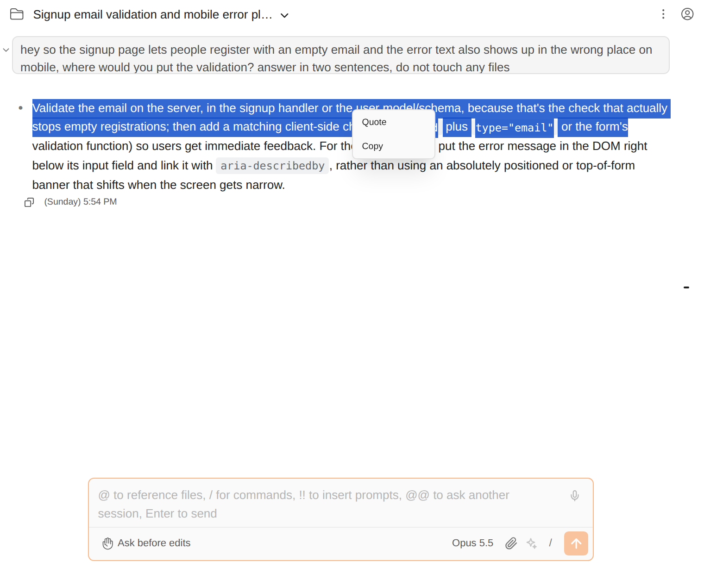
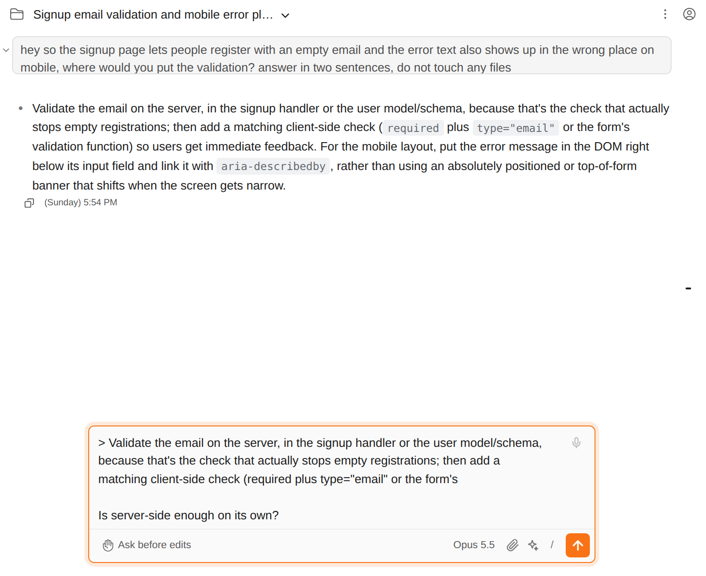
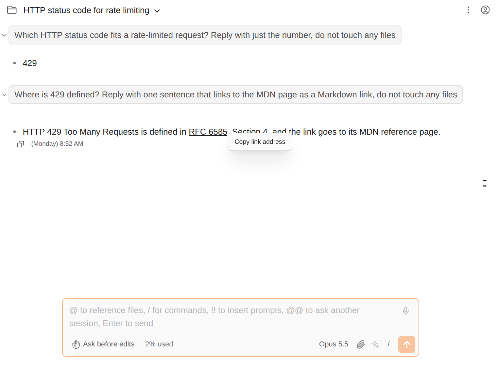

# 답변 인용하기, 링크 주소 복사하기

> 언어: [English](./en.md) · **한국어**

답변의 일부를 선택하고 우클릭하면 **Quote**와 **Copy**가 있는 작은 메뉴가 뜹니다. **Quote**는 그 구절을 마크다운 인용으로 채팅 입력창에 넣고, 아래에 질문을 쓸 빈 줄을 남깁니다.

답변 속 링크를 우클릭하면 대신 **Copy link address**가 뜹니다. 링크 글자가 다른 말을 하더라도 링크가 실제로 가리키는 주소를 복사합니다.

같은 메뉴가 있는 CC GUI 플러그인에서 가져왔습니다.

## 인용이 적히는 모양

| | |
|---|---|
| **형식** | 줄마다 `> `로 시작합니다. Claude가 "이것에 대한 이야기"로 읽는 마크다운 인용입니다. 구절 안의 빈 줄도 인용 안에 남습니다. |
| **들어가는 자리** | 이미 쓴 글의 끝, 빈 줄 하나 띄우고. Quote를 고를 때는 커서가 답변 쪽으로 옮겨 가 있어서, 마지막 커서 위치는 인용을 어디 두고 싶은지 알려 주지 않습니다. |
| **그 뒤** | 빈 줄 하나와 그 아래의 커서. 바로 질문을 쓸 수 있습니다. 아무것도 전송되지 않습니다. |
| **복사되는 내용** | 화면에 읽히는 그대로의 글. `인라인 코드`를 감싸는 회색 상자처럼 글이 아닌 서식은 인용에 들어가지 않습니다. |

인용은 입력창의 평범한 글이라서, 보내기 전에 고치거나 줄이거나 여러 구절을 차례로 인용할 수 있습니다.

## 메뉴가 뜨는 때

메뉴는 보여 줄 것이 있을 때만 뜹니다. 링크 위이거나, 대화 안에서 글을 선택했을 때입니다. 다른 곳을 우클릭하면 지금까지처럼 브라우저나 IDE 자체의 메뉴가 뜹니다. 링크나 선택 위에서도 그 메뉴를 쓰려면 **Shift**를 누른 채 우클릭하세요.

항목을 고르거나 Esc를 누르거나 다른 곳을 클릭하거나 스크롤하면 메뉴가 닫힙니다.

## 한계

- **대화 안에서만.** 입력창, 설정, 대화상자의 글에는 적용되지 않습니다.
- **페이지 안 링크는 대상이 아닙니다.** 페이지 안에서만 이동하는 링크는 복사할 만한 주소가 없습니다.
- **복사에는 클립보드 권한이 필요합니다.** 브라우저가 거부하면 복사에 실패했다는 안내가 뜹니다.

## 자주 묻는 질문

**답변 전체를 인용할 수 있나요?** 첫 단어부터 마지막 단어까지 드래그해 전부 선택하고 Quote를 고르세요. 내가 보낸 메시지를 복사하려면 그 메시지의 ⋮ 메뉴에 있는 **Copy message**를 쓰세요.

**왜 Quote는 내가 쓰던 자리가 아니라 끝에 넣나요?** 답변에서 글을 선택하는 순간 커서가 입력창을 떠나기 때문입니다. 원하는 자리로 옮기려면 잘라내어 붙이거나, 먼저 인용하고 그 뒤에 쓰세요.
