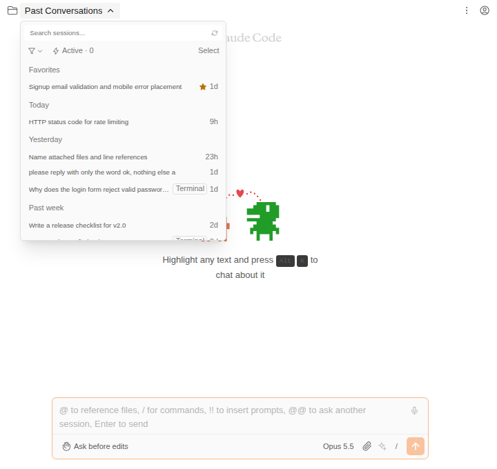
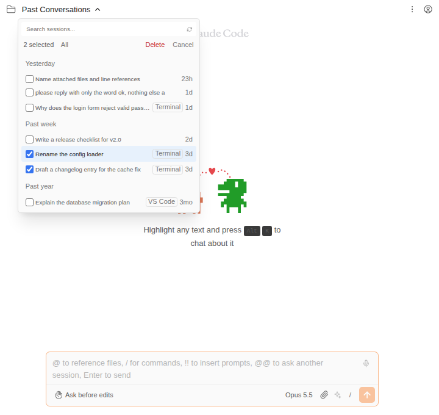
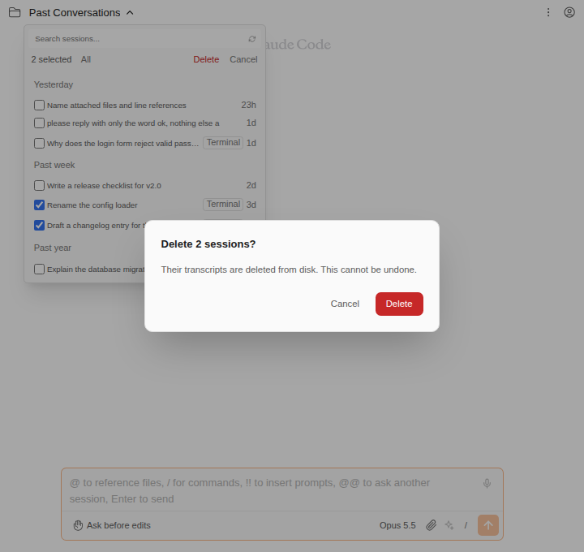
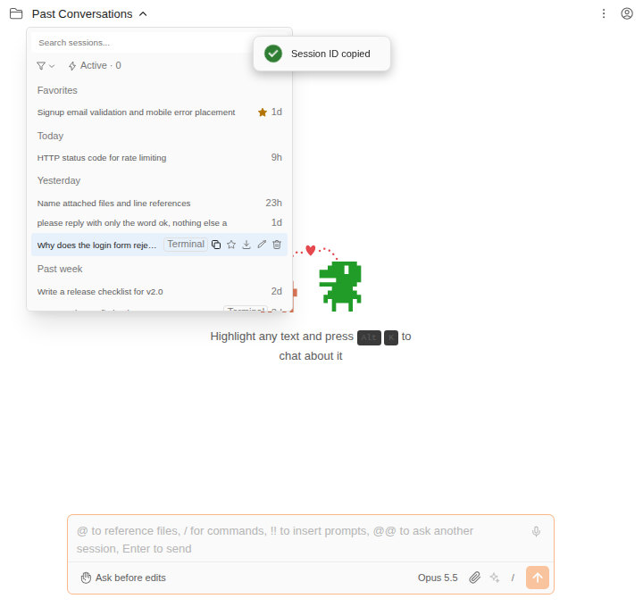

# 세션 여러 개 한꺼번에 삭제, 세션 ID 복사, 세션이 시작된 곳 표시

> Language: [English](./en.md) · **한국어**

세션 목록에 세 가지가 더해졌습니다. 세션 드롭다운과 사이드 세션 패널 양쪽에 똑같이 들어 있습니다. 세 가지를 모두 갖춘 CC GUI 플러그인에서 가져왔습니다.

- **Select** 로 세션 여러 개를 골라 확인 한 번으로 지웁니다.
- 각 행의 **복사** 버튼이 세션 ID를 클립보드에 넣습니다.
- 여기서 시작하지 않은 세션에는 어디서 시작됐는지 작은 라벨이 붙습니다: **Terminal**, **VS Code**, **Desktop**, **Remote**, **GitHub**.

## 세션 여러 개 지우기

1. 세션 목록을 열고 필터 줄 오른쪽 끝의 **Select** 를 누릅니다.
2. 지울 세션을 누릅니다. 고르는 동안에는 행을 눌러도 세션이 열리지 않고 체크만 되며, 필터 줄은 체크한 개수를 세는 막대로 바뀝니다.
3. 그 막대의 **Delete** 를 누르고 확인합니다.

| | |
|---|---|
| **All** | 목록이 지금 보여주는 세션을 모두 체크합니다. 검색이나 필터가 켜져 있으면 일치하는 세션만이며, 존재하는 모든 세션이 아닙니다. |
| **Delete** | 체크한 세션 전부에 대해 한 번만 묻고, 하나씩 차례로 지웁니다. 아무것도 체크하지 않았으면 흐리게 꺼져 있습니다. |
| 막대의 **Cancel** | 아무것도 지우지 않고 고르기를 끝냅니다. |
| 확인창의 **Cancel** | 아무것도 지우지 않고 체크는 그대로 둡니다. 하나를 빼고 다시 시도할 수 있습니다. |

삭제가 끝나면 목록은 원래 모습으로 돌아옵니다.

여기서 지우는 것은 행 하나의 휴지통 버튼과 같습니다. 세션마다 트랜스크립트(`~/.claude/projects/<프로젝트>/<세션 ID>.jsonl`)가 디스크에서 지워지고, 직접 지은 이름·생성된 제목·별표·그 세션으로 예약된 메시지도 함께 지워집니다. 지운 세션은 여기서도 `claude --resume` 으로도 다시 이어갈 수 없습니다. 지금 채팅에 열려 있는 세션이 포함되어 있으면 채팅은 새 세션으로 넘어갑니다.

## 세션 ID 복사

행에 마우스를 올리고 버튼 중 첫 번째(겹친 사각형 두 개)를 누릅니다. 세션 ID가 복사되고 **Session ID copied** 안내가 뜹니다.

ID는 CLI가 대화를 찾을 때 쓰는 값이라 터미널에서 `claude --resume <id>` 로 이어가거나 버그 제보에 적을 수 있습니다. 세션 트랜스크립트의 파일 이름이기도 합니다.

## 세션이 시작된 곳

Claude Code는 모든 트랜스크립트에 대화가 어디서 시작됐는지 기록합니다. 목록은 그 값을 읽어 다른 곳에서 시작된 세션에 라벨을 붙입니다.

| 라벨 | 시작된 곳 |
|---|---|
| **Terminal** | 터미널의 `claude` |
| **VS Code** | VS Code용 Claude Code 확장(Cursor에서 실행한 경우 포함) |
| **Desktop** | Claude 데스크톱 앱 |
| **Remote** | 원격에서 실행된 Claude Code 세션 |
| **GitHub** | Claude Code GitHub Action |

라벨에 마우스를 올리면 더 긴 설명이 나옵니다.

여기서 시작한 세션에는 라벨이 없습니다. 여기서 시작한 세션마다 같은 라벨이 붙을 뿐이기 때문입니다. CLI가 시작 위치를 기록하기 전의 오래된 세션과, 직접 만든 프로그램이 CLI를 통해 시작한 세션에도 라벨이 없습니다. 이런 세션은 여기서 시작한 세션과 똑같이 기록되어 목록이 구분할 수 없습니다.

## 한계

- **Select는 삭제만 합니다.** 여러 개를 한꺼번에 별표·내보내기·이름 바꾸기 하는 기능은 없습니다.
- **아직 불러오지 않은 세션은 체크할 수 없습니다.** 목록은 스크롤할 때 오래된 세션을 이어서 불러오고, **All** 은 지금까지 불러온 세션만 체크합니다. 나머지까지 고르려면 먼저 끝까지 스크롤하거나 검색하세요.
- **라벨은 세션이 시작된 곳이지, 마지막으로 쓴 곳이 아닙니다.** 터미널에서 시작해 여기서 이어간 세션은 계속 **Terminal** 라벨을 답니다.
- **복사에는 클립보드 권한이 필요합니다.** 브라우저가 거절하면 **Could not copy** 안내가 뜹니다.

## 자주 묻는 질문

**삭제를 되돌릴 수 있나요?** 아니요. 세션 하나를 지울 때와 마찬가지로 트랜스크립트가 디스크에서 지워집니다. `~/.claude/projects` 를 백업해 두었다면 그 파일을 되돌려 놓으면 세션이 돌아옵니다.

**세션 하나가 안 지워졌어요.** 파일을 지울 수 없었던 세션(예: 다른 프로그램이 파일을 쥐고 있는 경우)은 목록에 남고, 나머지는 그대로 지워집니다. 그 세션만 따로 다시 지워 보세요.

**여기서 시작한 세션에 왜 라벨이 없나요?** 다른 곳에서 시작한 세션에만 라벨을 붙이기 때문입니다. 라벨이 없으면 "여기서 시작했거나, 알 수 없음"이라는 뜻입니다.
