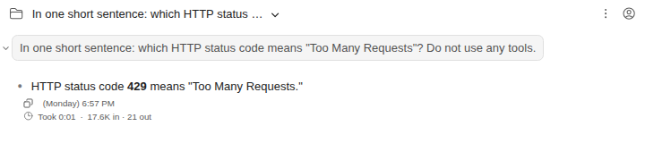

# How long a reply took, and the tokens it used

> Language: **English** · [한국어](./ko.md)

When Claude finishes answering, a small line under the reply says how long the turn took and how many tokens it used. Ported from the CC GUI plugin, which shows the same under its last reply.

## What the line says

| Part | Meaning |
|---|---|
| **Took 0:01** | From the moment the turn started to the moment Claude finished, as minutes and seconds (`1:02:05` past an hour). This is the whole turn, tool calls included, not only the time spent writing the reply. |
| **17.6K in** | Every input token the turn sent to the model, across all its requests: new input, input written to the prompt cache, and input read back from the cache. |
| **21 out** | The tokens the model wrote. |

Hover the token count to see the input split up, for example *"Input: 2 new, 3.9K written to cache, 13.7K read from cache. Output: 21."*. Most of a long conversation's input is read from the cache, which is cheaper and faster than new input, so this split tells you more than the total does.

The figures are Claude Code's own: they come from the summary it sends at the end of every turn (its `result` event), unchanged.

## When it appears

- **Under every reply that reached the model**, in the conversation you are watching, as soon as the turn ends.
- **Not for turns that used no tokens**, such as a slash command Claude Code answers itself (`/cost`) or a request refused before it was sent. A duration alone would only add a line of noise there.
- **Folding a reply** with the arrow beside your message hides its line with it.

## Limits

- **Only while you watch.** Claude Code sends this summary live and does not write it to the session file. Reopen the conversation, reload the page or restart the IDE, and the lines of earlier replies are gone. The conversation itself is unaffected.
- **No cost.** Claude Code reports cost as a running total for its process, not per reply: two one-word replies in a row reported $0.048 and then $0.078. That total starts over whenever the process does, for example when a session is resumed, so no figure shown here could honestly be called the cost of this reply. CC GUI shows a cost in its detailed mode; this plugin leaves it out rather than show a number that might be wrong.
- **Only the turn as a whole.** A turn that runs several tools makes several requests to the model; the line adds them up and does not list them one by one.

## Common questions

**Why is "in" so much larger than what I typed?** Every request carries the whole conversation so far, plus Claude Code's own instructions and tool descriptions. Most of that is read from the cache, which the hover detail shows.

**Does this count against my plan's limits?** The line reports usage; it does not change it. Your plan's limits are shown in the usage panel.
