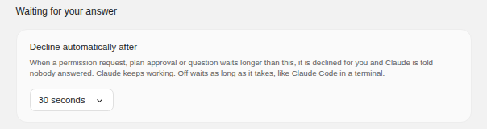
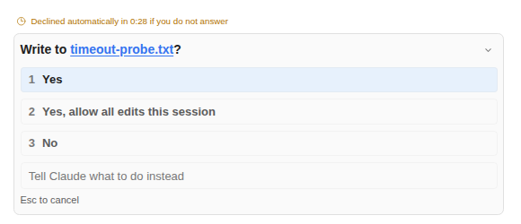
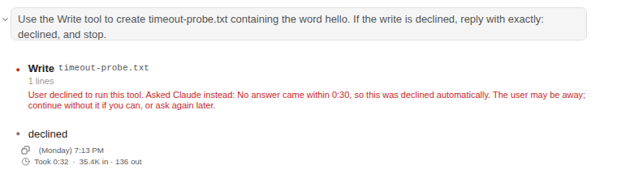

# 기다리는 요청을 자동으로 거절하기

> Language: [English](./en.md) · **한국어**

Claude가 권한을 묻거나, 계획 승인을 구하거나, 질문을 하면 채팅은 답을 기다립니다. 자리를 비우면 돌아올 때까지 기다립니다. 이제 한도를 정할 수 있습니다. 그 시간이 지나면 대신 거절하고, 아무도 답하지 않았다고 Claude에게 알리며, Claude는 나머지 작업을 이어 갑니다. 같은 타임아웃을 가진 CC GUI 플러그인에서 가져왔습니다.

**기본값은 꺼짐**이라, 설정하기 전에는 아무것도 달라지지 않습니다.

## 설정하기

**설정 → Permissions → Waiting for your answer → Decline automatically after.** **Off**(기본), 30초, 1·2·5·10·30분, 1시간 중에서 고릅니다.

다른 설정처럼 모든 프로젝트에 적용하거나, **Project Settings** 탭에서 한 프로젝트에만 적용할 수 있습니다.

## 화면에 보이는 것

요청이 기다리는 동안 그 위에 남은 시간이 표시됩니다. 마지막 30초에는 주황색으로 바뀝니다.

언제든 답하면 카운트다운이 멈추고 답은 평소처럼 전달됩니다. 새 요청마다 시간이 처음부터 다시 시작합니다. 패널을 접어도 멈추지 않습니다.

시간이 다 되면:

| 요청 | 일어나는 일 |
|---|---|
| **권한**(명령 실행, 파일 편집 등) | 거절됩니다. 아무것도 실행되거나 쓰이지 않습니다. |
| **계획 승인** | 승인되지 않습니다. Claude는 계획대로 시작하지 않습니다. |
| **질문** | 답하지 않은 채로 넘어갑니다. |

어느 경우든 Claude는 답 대신 다음 메시지를 받고 계속합니다: *"No answer came within 5:00, so this was declined automatically. The user may be away; continue without it if you can, or ask again later."*

## Esc와 무엇이 다른가

**Esc to cancel**은 Claude의 턴 전체를 멈춥니다. 자리에 있고 멈추기를 원하는 경우입니다. 타임아웃은 그 요청 하나만 거절합니다. 자리를 비운 동안 Claude가 계속 일하게 하려는 것이기 때문입니다. "거절했다"가 아니라 "아무도 답하지 않았다"고 알리므로, Claude는 나중에 다시 물을 수도 있습니다.

## 한계

- **채팅이 열려 있을 때만 셉니다.** 카운트다운은 채팅 창에서 돕니다. 그 세션을 보여 주는 채팅 창이 없으면 아무것도 세지 않고 요청은 예전처럼 기다립니다.
- **시간은 요청이 화면에 뜬 때부터 셉니다.** Claude가 물은 때가 아닙니다. 한 시간째 기다리던 세션을 열면 카운트다운이 새로 시작합니다.
- **요청 id 없이 온 질문은 이 방법으로 거절할 수 없어** 카운트다운이 뜨지 않습니다. 드문 경우이며, 그런 질문은 예전처럼 기다립니다.
- **"계속"이 무엇인지는 Claude가 정합니다.** 다른 방법을 시도하거나, 그 단계를 건너뛰거나, 멈추고 설명할 수 있습니다. 꼭 필요한 단계였다면 그냥 턴을 끝낼 수도 있습니다.

## 자주 묻는 질문

**다시 무기한 기다리게 할 수 있나요?** **Off**를 고르세요.

**자리를 비운 동안 명령을 대신 실행하나요?** 아니요. 타임아웃은 항상 거절하며, 무엇도 승인하지 않습니다.
