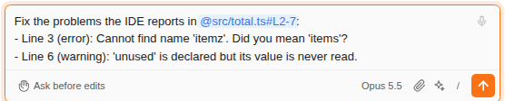

# Fix with Claude

> Language: [English](./en.md) · **한국어**

에디터에서 우클릭해 **Fix with Claude**를 고르면, 선택한 줄(선택이 없으면 커서가 있는 줄)과 그 안에서 IDE가 알려 주는 오류·경고가 채팅 입력창에 들어갑니다. Claude에게 알려 줄 것을 덧붙여 보내면 됩니다. CC GUI 플러그인의 Quick Fix에서 가져왔습니다.

## 입력창에 들어가는 것

| 에디터에서 | 입력창에 |
|---|---|
| 줄을 선택했고, 그 안에 IDE가 알려 주는 문제가 있음 | `IDE가 @path#L2-7에서 알려 주는 문제를 고쳐 줘:` 다음에 문제마다 한 줄: 줄 번호, 오류인지 경고인지, IDE의 메시지 그대로 |
| 줄을 선택했고, 문제가 없음 | `@path#L2-7 고쳐 줘: ` 뒤에 커서가 있어, 무엇을 고칠지 쓰면 됩니다 |
| 아무것도 선택하지 않음 | 위와 같되, 커서가 있는 줄로 |

- **오류와 경고만** 넣습니다. IDE는 약한 경고·오타·힌트도 표시하지만, 요청이 고장 난 것에 집중하도록 뺍니다.
- **최대 20개**, 같은 것은 한 번만, 줄 순서대로.
- 글은 Alt+K처럼 입력창의 **커서 자리에** 들어가고 입력창에 포커스가 갑니다. 직접 보내기 전에는 **아무것도 보내지 않습니다**.
- 참조 주변의 문장은 인터페이스 언어로 씁니다. 내 말로 보내는 것이기 때문입니다.

## 그다음

Claude는 그 줄들을 읽고(`@path#L…` 참조가 첨부해 줍니다) 여느 파일을 바꿀 때처럼 고칩니다. 편집 도구로 고치고, 무엇이든 쓰기 전에 diff에서 검토하게 됩니다. 묻지 않고 편집하게 하려면 평소처럼 권한 모드를 쓰면 됩니다.

## CC GUI와 다른 점

CC GUI는 에디터 위에 작은 입력 상자를 띄우고, 요청을 새 채팅 탭에서 보낸 뒤, Claude 답의 코드 블록을 선택 영역에 붙여 넣습니다. 여기서는 요청을 채팅 입력창에서 쓰고, 지금 대화에서 이어 가며, 변경은 검토하는 편집으로 들어옵니다. 이유는 두 가지입니다. 이 플러그인은 화면을 채팅 안에만 그리고, Claude가 자기 도구로 한 편집은 Claude 자신이 했다고 알기 때문에 대화의 나머지가 파일과 어긋나지 않습니다.

## 한계

- **JetBrains IDE에서만** 됩니다. 에디터의 우클릭 메뉴에 있는 기능이라, 브라우저에는 우클릭할 에디터가 없습니다.
- **IDE가 찾은 것만** 넣습니다. 문제는 IDE가 파일을 분석한 뒤에 나타납니다. 큰 파일을 막 열었거나 인덱싱 중이면 목록이 짧거나 비어 있을 수 있습니다. 분석이 끝나길 기다리거나, 참조만 그대로 보내세요.
- 기본 **단축키는 없습니다.** **Settings → Keymap**에서 이 액션 이름으로 지정할 수 있습니다.

## 자주 묻는 질문

**Alt+K와 무엇이 다른가요?** Alt+K는 참조만 넣습니다. Fix with Claude는 "고쳐 줘"라는 말과 IDE가 알려 주는 문제를 함께 넣어, 오류 메시지를 복사하지 않아도 Claude가 무엇이 잘못됐는지 압니다.

**보내기 전에 글을 고칠 수 있나요?** 네. 입력창의 평범한 글입니다.
