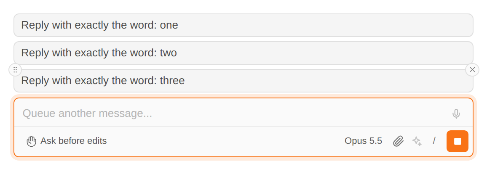
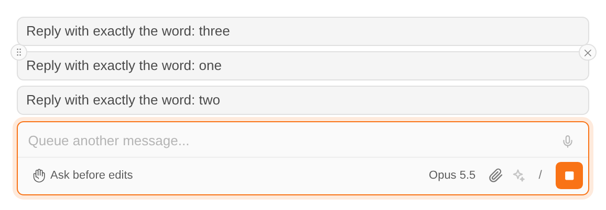
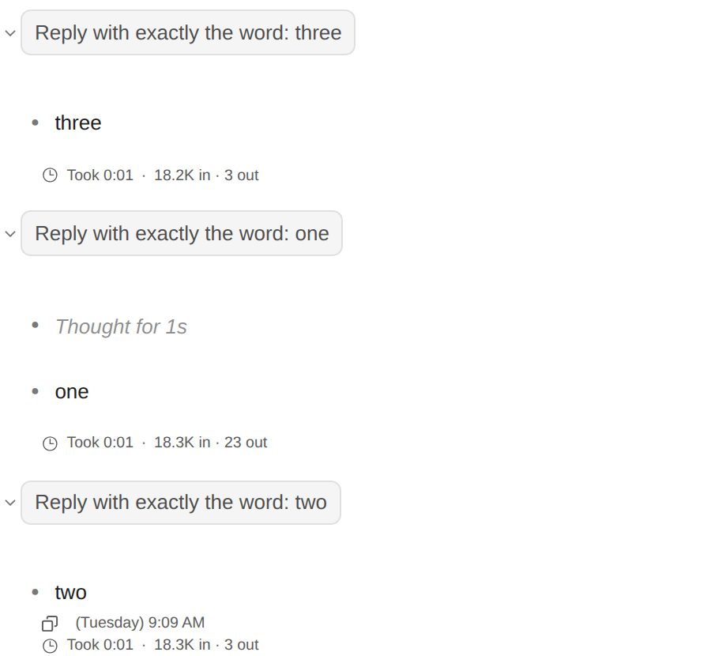

# 대기 중인 메시지 순서 바꾸기

> Language: [English](./en.md) · **한국어**

Claude가 답하는 동안 보낸 메시지는 입력창 위에서 기다렸다가, 답이 하나 끝날 때마다 오래된 것부터 하나씩 나갑니다. 이제 끌어서 순서를 바꿀 수 있습니다. 맨 위 메시지가 다음에 보내집니다. CC GUI 플러그인의 메시지 대기열에서 가져왔습니다.

## 쓰는 법

1. 기다리는 메시지 **묶음에 마우스를 올립니다**(키보드 포커스를 옮겨도 됩니다). 맨 위 것부터 목록으로 펼쳐집니다.
2. **메시지에 마우스를 올립니다.** 왼쪽 위 모서리에 점 여섯 개짜리 둥근 손잡이가 나타납니다. 지우는 ×의 반대쪽입니다.
3. **손잡이를 위아래로 끕니다.** 다른 메시지가 비켜나고, 원하는 자리에서 놓으면 됩니다.

바뀐 순서는 백엔드가 들고 있어서 이 대화를 보는 모든 탭에 같이 보이고, 그 순서대로 보내집니다.

### 키보드로

메시지의 손잡이로 Tab 이동한 뒤 **Space**로 집고, **↑ / ↓**로 옮기고, **Space**로 놓습니다. **Esc**는 원래 자리로 돌려놓습니다.

## 자세히

- **끄는 중에 누른 Esc는 끌기만 취소합니다.** 메시지는 제자리로 돌아가고 Claude의 답은 계속됩니다. 답을 멈추는 Esc로 이어지지 않습니다.
- **끄는 사이에 보내진 메시지**는 놓을 때 목록에 없을 뿐이고, 나머지는 정한 순서를 지킵니다. 그 사이 다른 탭에서 대기열에 넣은 메시지는 정리한 것들 뒤에 붙습니다. 빠지거나 두 번 보내지는 메시지는 없습니다.
- **메시지가 하나뿐이면 끌 것이 없습니다.** 손잡이는 두 개 이상 기다릴 때만 나타납니다.
- **메시지 지우기**는 그대로 ×로 합니다.

## 함께 고친 것

답 아래의 "Took 0:07 · 17.7K in · 514 out" 줄([091](../091-reply_duration_and_tokens/ko.md))이 그 답이 아니라 **다음 대기 메시지 아래**에 붙었습니다. 답이 끝나면 다음 대기 메시지가 먼저 보내져 화면에 뜨고, 그 뒤에 답의 수치가 도착하기 때문입니다. 이제 그 답이 시작된 뒤에 보낸 메시지보다 위에 놓입니다.

## 한계

- 이 앱의 대기열에서 기다리는 메시지만 순서를 바꿀 수 있습니다. 입력창이 바로 보내기로 설정되어 있을 때 Claude가 일하는 중에 친 메시지는 Claude Code 자체 버퍼로 가서, 보여 주거나 순서를 바꿀 수 없습니다.
- 순서는 대기열 자체처럼 백엔드 메모리에 있습니다. Claude Code가 멈추면 기다리던 메시지는 사라집니다.
