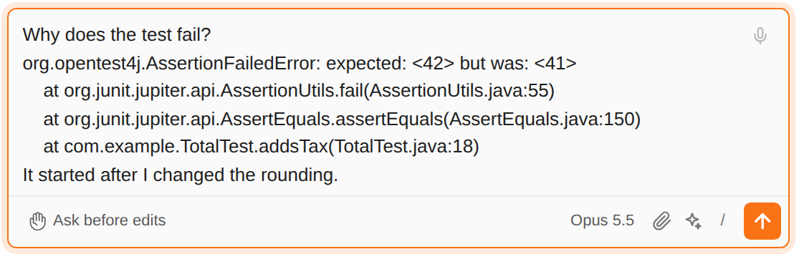

# 콘솔 출력을 Claude에게 보내기

> Language: [English](./en.md) · **한국어**

Run이나 Debug 콘솔에서 글을 선택하고(스택 트레이스, 실패한 테스트의 메시지, 로그 한 줄) 우클릭해 **Send Selection to Claude Code**를 고르세요. 그 글이 있는 그대로, 자기 줄에 채팅 입력창으로 들어가고, 커서는 그 아래 줄에서 무엇을 원하는지 쓰기를 기다립니다. 직접 보내기 전에는 아무것도 보내지 않습니다. CC GUI 플러그인에서 가져왔습니다.

## 어디에 있나

프로그램 출력을 보여 주는 모든 콘솔(Run, Debug, 테스트 실행)의 우클릭 메뉴에 있습니다. 글을 선택했을 때만 나타납니다.

## 입력창에 들어가는 것

- **선택한 글 그대로.** 탭까지 그대로라 스택 트레이스 모양이 유지됩니다. Windows 줄 끝은 일반 줄 끝으로 바뀝니다.
- **자기 줄에.** 커서가 줄 중간에 있으면 글은 다음 줄에서 시작하고, 커서는 글 다음 줄에 놓입니다.
- **커서 자리에**, Alt+K처럼 마지막으로 포커스를 가졌던 채팅에. 열린 채팅이 없으면 하나 엽니다.
- **최대 200,000자.** 그보다 길면 오류가 보통 있는 끝부분을 남기고, 잘린 앞자리에 "…"를 둡니다.

이 글은 내가 Claude에게 하는 말이라, 직접 쓴 글처럼 보내집니다. Claude Code는 첨부 파일이 아니라 메시지 안에서 이 글을 봅니다.

## Alt+K와 다른 점

코드 에디터의 Alt+K는 Claude Code가 파일을 읽어 오는 참조(`@src/file.ts#L10-12`)를 넣습니다. 콘솔에는 뒤에 파일이 없으니 글 자체가 들어갑니다.

## 함께 고친 것

**Fix with Claude**([093](../093-fix_with_claude/ko.md))가 빈 입력창에 IDE의 문제 목록을 넣은 뒤, 처음 입력한 단어가 새 줄이 아니라 마지막 문제 줄 끝에 붙었습니다. 이제 둘 다 커서를 빈 줄에 둡니다.

## 한계

- **Terminal 도구 창에는 같은 이름의 항목이 따로 있습니다.** [터미널 출력을 Claude에게 보내기](../102-send_terminal_selection/ko.md)를 보세요.
- **JetBrains IDE에서만** 됩니다. 브라우저에는 Run 콘솔이 없습니다.
- 콘솔 출력에는 비밀값이 섞일 수 있습니다(로그 속 토큰, 환경 변수 덤프). 보낸 글은 다른 메시지처럼 Claude에게 가니, 보내기 전에 선택한 글을 확인하세요.
