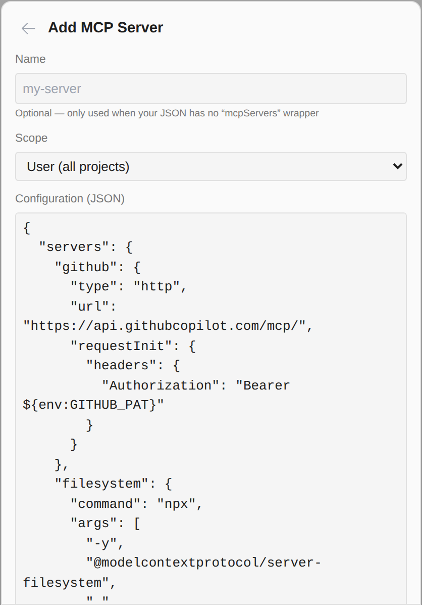
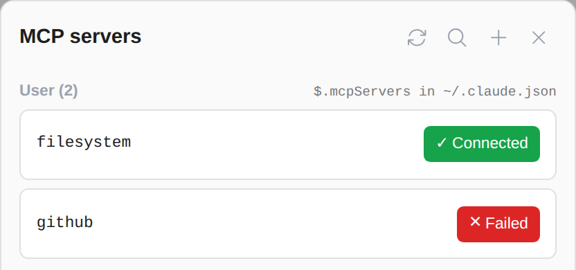
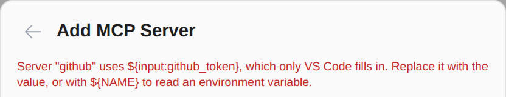

# Add MCP servers from a GitHub Copilot or VS Code config

> Language: **English** · [한국어](./ko.md)

If your MCP servers are already set up for GitHub Copilot or VS Code, you can paste that `mcp.json` into **Add MCP Server** as it is. Every server in it is added to Claude Code, converted to the form Claude Code reads. Ported from the CC GUI plugin's Copilot import.

## How to use it

1. Open the MCP servers panel and press **+** (Add MCP server).
2. Paste the whole file: the JSON with `"servers"` at the top, the way Copilot and VS Code write it. Leave **Name** empty; each server keeps the name it has in the file.
3. Pick the **Scope** (user, project or local), as for any server, and press **Add server**.

The "github" server in this picture shows Failed only because the test machine had no `GITHUB_PAT` set; with the variable set it connects like any other.

## What is converted

Claude Code takes most of a Copilot entry as it is, but some parts it would drop **without a word** (checked against Claude Code 2.1.291), so they are converted first:

| In the Copilot / VS Code config | Added to Claude Code as |
|---|---|
| `command`, `args`, `env`, `url`, `type`, `headers` | the same |
| `requestInit.headers` | `headers` (a header in both places keeps the direct one) |
| no `type` | `stdio` for a command, `sse` for a URL ending in `/sse`, `http` for any other URL (Claude Code refuses a remote server without one) |
| `${env:NAME}` | `${NAME}`, how Claude Code reads the same environment variable |
| anything else (`dev`, `gallery`, the top-level `inputs`, …) | left out |

## What is refused, and why

Some settings have no equivalent in Claude Code. Rather than add a server that cannot work, the form says which server and what to change:

- **`${input:…}`**: a value VS Code asks you for when the server starts. Claude Code has no prompt for it; put the value in, or keep it in an environment variable and write `${NAME}`.
- **`${workspaceFolder}`, `${userHome}` and other VS Code variables**: Claude Code does not fill them in. Write the path.
- **`envFile`**: Claude Code does not read environment files. Put the variables under `env`.

Nothing is added until every server in the paste can be added.

## Common questions

**Where is the Copilot config?** In VS Code, `.vscode/mcp.json` in the project or the user `mcp.json` (Command Palette → "MCP: Open User Configuration"). In GitHub Copilot for JetBrains, the MCP settings page of the Copilot plugin opens the same kind of file.

**Does this change the Copilot config?** No. It is only read from what you paste.

**Can I still paste a Claude config?** Yes. A paste with `"mcpServers"` is added exactly as before, unchanged; if a paste has both keys, `mcpServers` is used.
