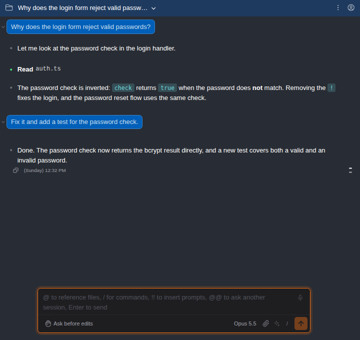
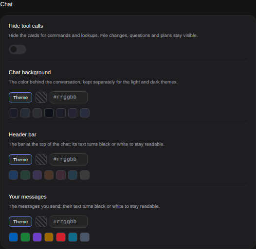
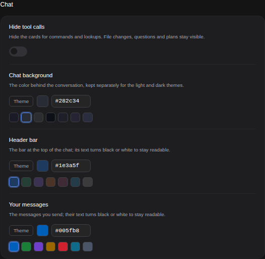
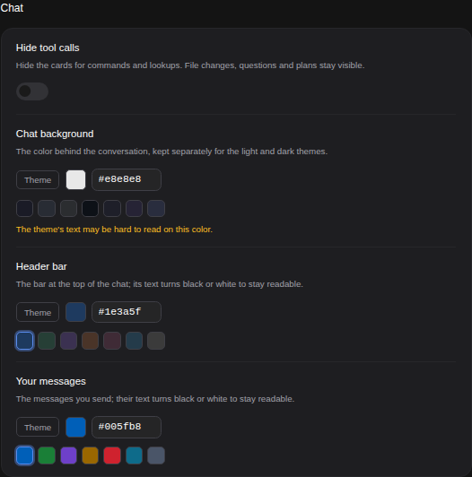
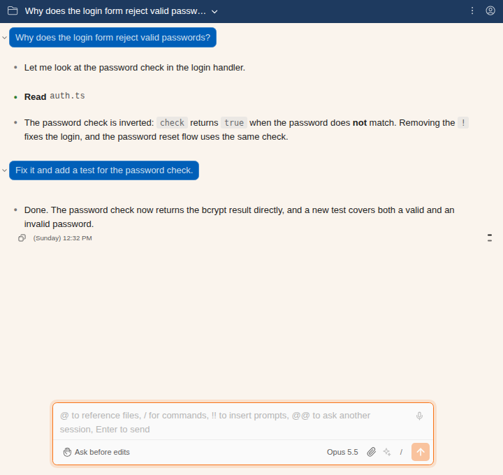

# Your own colors for the chat

> Language: **English** · [한국어](./ko.md)

Three parts of the chat can take a color you pick: the **background** behind the conversation, the **header bar** at the top, and **your messages**. Give a project's header its own color and you can tell its tab from the others at a glance; tint your messages and they stand out from the replies. Ported from the CC GUI plugin's chat background, header bar and user message colors.

## Where it is

**Settings → Appearance → Chat**, under **Hide tool calls**. Each of the three rows starts on **Theme**, which means the chat looks exactly as it did before.

## Picking a color

Each row offers four ways, and they all do the same thing:

- **A preset**: the row of swatches under it. Click one.
- **The swatch** next to **Theme** opens your system's color picker. The color is saved when you close the picker, not at every step of the drag.
- **The code field**: type a color as `#rrggbb` (for example `#1e3a5f`) and press Enter or click elsewhere. Anything that is not a whole `#rrggbb` code is underlined in red and dropped when you leave the field; the color you had stays.
- **Theme** goes back to the theme's own color.

The change shows in every open chat right away. Nothing needs to be restarted.

## Readable text, worked out for you

- **Header bar and your messages** switch their own text to black or white, whichever reads better on the color you picked, and work out matching shades for the quieter text, the hover highlight and the border. A pale header in the dark theme gets dark text; a deep blue one gets white text. The menus that open from the header (sessions, working folder, ⋮, accounts) keep the theme's colors, because they sit on the theme's own panels.
- **The chat background** keeps the theme's text, because that text is the whole conversation, code and tool cards included. If the color you pick makes the theme's text hard to read, the row says so: *The theme's text may be hard to read on this color.* It is a warning only; the color is still saved.

## Light and dark

- **The header bar and your messages use one color in both themes.** Their text follows the color, so the same choice reads in either theme.
- **The chat background is kept separately for the light and the dark theme.** Its text is the theme's, so a dark background chosen at night would leave the light theme's dark text on dark. The row edits the background of the theme on screen, and offers that theme's presets; switch themes and you pick the other one. With the color theme on **System**, the background switches along with your system or IDE.

## Per project

Like other settings, the colors can be set per project from the **Project** tab of Settings, for example a different header color for each repository. In the Project tab:

- Leaving the code field empty means *not set here*: the project follows the global color. The field then reads **Not set**.
- **Theme** means the theme's color for this project, even when the global setting has a color.

When a project sets a color, the same row in the **Global** tab is dimmed and marked, because changing it there would not show in that project.

## Common questions

**Where is it saved?** In the plugin's settings file (`~/.claude-code-gui/settings.js`, or the project's `.claude-code-gui/settings.json`) as `chatBackgroundColorDark`, `chatBackgroundColorLight`, `headerBarColor` and `userMessageColor`. Each is a `"#rrggbb"` string or `null` for the theme. Claude Code's own settings are not touched.

**Clicking the swatch opens nothing.** Some IDE versions do not open a system color picker from the embedded browser. The presets and the code field work everywhere.

**Does it change the code blocks, tool cards or the input box?** No. They keep the theme's colors and sit on top of the background you chose.

**Messages another session sent here** (see [062](../062-peer_message_appears_live/en.md)) keep the theme's bubble, so they never look like something you wrote.

**Does it work with "Sync with IDE"?** Yes. Unset areas follow the IDE theme's colors as before; set areas use your color.

## Limits

- Colors are written as `#rrggbb` only. Names (`red`), short codes (`#fff`) and transparency are not accepted, so every value means the same thing everywhere.
- The background warning is a guide: it compares your color with the theme's main text color, so a color it accepts may still make some quieter text harder to read.
