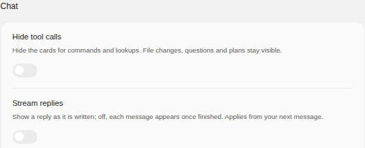
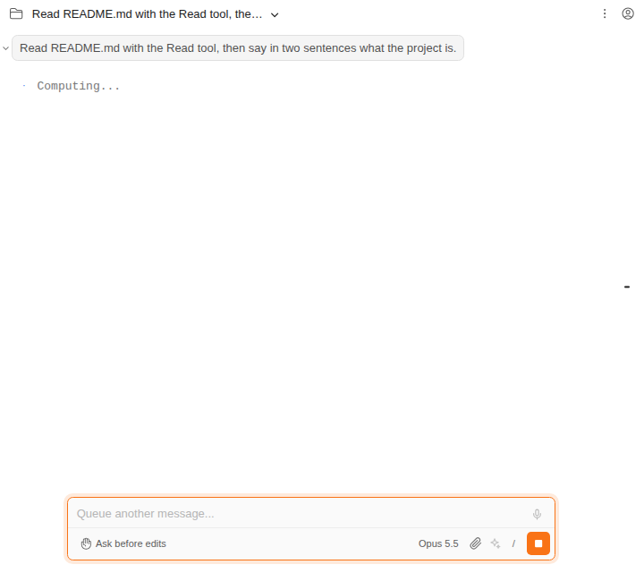
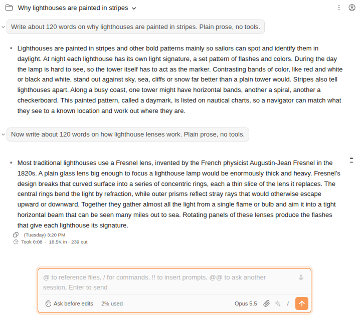

# 답변을 흘려 보내지 않고 한 번에 보기

> Language: [English](./en.md) · **한국어**

기본적으로 답변은 Claude가 쓰는 대로 채팅에 흘러나옵니다. 다 쓴 뒤에 읽고 싶다면 **Stream replies**를 끄세요. 그러면 메시지마다 완성된 채로 나타납니다. CC GUI 플러그인의 Streaming 스위치에서 가져왔습니다.

## 어디에 있나

**설정 → 모양 → 채팅 → Stream replies**입니다. 끄지 않으면 켜져 있고, 채팅이 늘 동작하던 방식입니다.

## 끄면 무엇이 달라지나

- **메시지가 한 덩어리로 나타납니다.** Claude가 다 쓴 뒤입니다. 도구를 쓰는 턴은 여전히 단계마다 보입니다. 호출하면 도구 카드가, 돌아오면 결과가, 그 뒤에 글이 나옵니다.
- **Claude가 아직 쓰는 동안**에는 내 메시지 아래에 평소의 작업 표시가 보이고, 글이 자라나지는 않습니다.

- **나머지는 그대로입니다.** 저장되는 대화, 다시 열었을 때 보이는 것, 답변 소요 시간·토큰 줄([091](../091-reply_duration_and_tokens/ko.md)), 권한 요청과 질문 모두 전과 같습니다.

## 언제 적용되나

**다음 메시지부터**입니다. 스트리밍 여부는 Claude Code가 시작할 때 정하므로, 스위치를 바꾼 뒤 보내는 다음 메시지에서 채팅이 Claude Code를 다시 시작합니다. 대화는 있던 자리에서 이어집니다. 이미 쓰고 있는 답변은 시작한 방식대로 끝납니다.

## 어떻게 동작하나

채팅이 흉내 내는 것이 아니라 Claude Code 자신의 선택입니다. 켜져 있으면 채팅이 Claude Code를 `--include-partial-messages`와 함께 시작해 글을 쓰는 대로 받습니다. 끄면 이 플래그를 빼고, Claude Code는 메시지를 통째로 보냅니다. 터미널에서 그 플래그 없이 `claude -p --output-format stream-json`을 실행한 것과 같습니다.

## 자주 묻는 질문

**더 빨라지나요?** 아니요. Claude가 걸리는 시간은 같고, 글을 늦게 볼 뿐입니다. 꺼 두면 채팅으로 가는 갱신이 줄어 느린 원격 연결에서는 도움이 될 수 있습니다.

**프로젝트마다 정할 수 있나요?** 네. 다른 설정처럼 설정의 **Project** 탭에서 정합니다.

**생각(thinking)에도 영향이 있나요?** 생각 요약(Claude Code의 `showThinkingSummaries`)도 그 생각이 끝난 뒤 한 번에 나타납니다.
