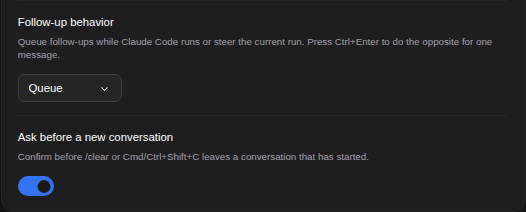
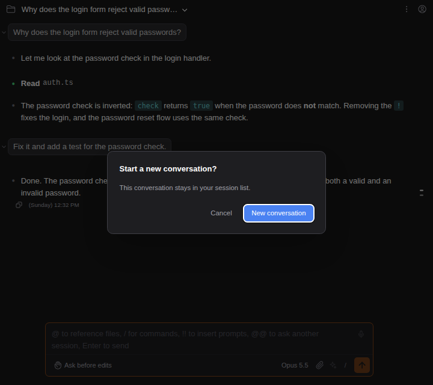

# Ask before leaving a conversation for a new one

> Language: **English** · [한국어](./ko.md)

`/clear`, **Cmd/Ctrl+Shift+C** and **Clear conversation** in the command panel start a new conversation in the same tab at once, as `/clear` does in a terminal. If you have ever pressed the shortcut by accident, or in the middle of a reply, turn **Ask before a new conversation** on and the chat asks first. Ported from the CC GUI plugin's new session confirmation.

## Where it is

**Settings → General → Composer → Ask before a new conversation**. It is off unless you turn it on, so nothing changes for anyone who leaves it alone.

## What it asks

- **New conversation** starts it, as before.
- **Cancel**, Escape or a click outside leaves you where you were, with your draft and everything else untouched.
- If Claude is still replying, the question also says that starting a new conversation stops the reply. Cancel lets it finish.

The conversation you leave is not deleted either way. It stays in the session list and opens again from there.

## When it does not ask

- **An empty new chat**: there is nothing to leave behind, so the new conversation starts at once.
- **The new tab button** opens a separate tab and leaves this one as it is, so it never asks.
- **Opening another session** from the session list is not leaving for a new conversation and does not ask.

## Common questions

**Why is it off by default?** Claude Code's own `/clear` never asks, and the chat follows the CLI unless you choose otherwise. (CC GUI asks by default; the choice is the same, only the starting point differs.)

**Can I set it per project?** Yes, from the **Project** tab of Settings, like other settings.
