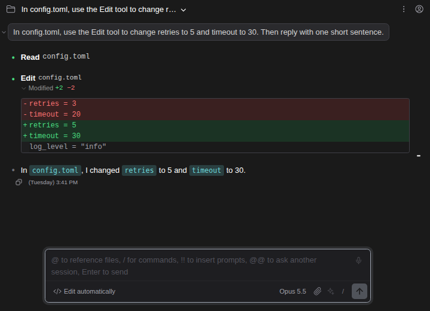
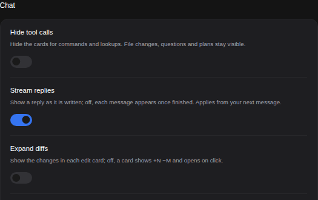
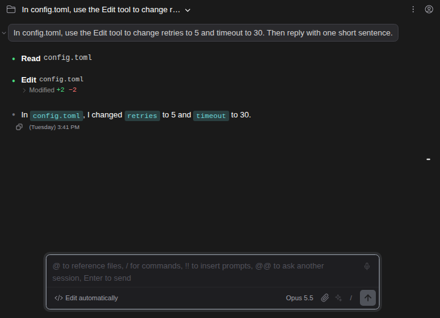

# 닫힌 채로 시작하는 편집 카드

> Language: [English](./en.md) · **한국어**

Claude가 파일을 고칠 때마다 채팅에는 바뀐 내용을 diff로 보여 주는 편집 카드가 생깁니다. 긴 세션에서는 이 diff들이 화면을 채웁니다. **Expand diffs**를 끄면 편집 카드가 모두 닫힌 채로 시작하고 얼마나 바뀌었는지만 보여 줍니다(`Modified +2 −2`). 누르면 diff가 보입니다. CC GUI 플러그인의 "Expand diffs by default"에서 가져왔습니다.

## 어디에 있나

**설정 → 모양 → 채팅 → Expand diffs**입니다. 끄지 않으면 켜져 있고, 채팅이 늘 편집을 보여 주던 방식입니다.

## 카드 하나만 열고 닫기

설정이 어느 쪽이든 편집 카드의 **Modified** 줄은 버튼입니다.

- 카드가 닫혀 있으면 화살표가 오른쪽을, 열려 있으면 아래를 가리킵니다.
- **Modified** 뒤에 넣은 줄(초록)과 지운 줄(빨강)의 수가 붙어서, 닫힌 카드도 변경이 얼마나 큰지 알려 줍니다.
- 누르면 그 카드만 열리거나 닫힙니다.

직접 열거나 닫은 카드는 설정을 바꿔도 그대로이고, 나머지 카드는 설정을 따릅니다.

## 자주 묻는 질문

**Claude가 파일에 쓰는 내용이 달라지나요?** 아니요. 채팅에서 카드가 어떻게 보이는지만 정합니다. 편집 전 승인 질문([030](../030-ide_diff_review/ko.md))은 전과 같습니다.

**열어도 diff가 안 보이는 카드가 있어요.** 채팅 폭이 약 400픽셀보다 좁으면 diff가 들어가지 않아 전처럼 **Modified**만 보입니다. 패널을 넓히면 보입니다.

**프로젝트마다 정할 수 있나요?** 네. 다른 설정처럼 설정의 **Project** 탭에서 정합니다.
