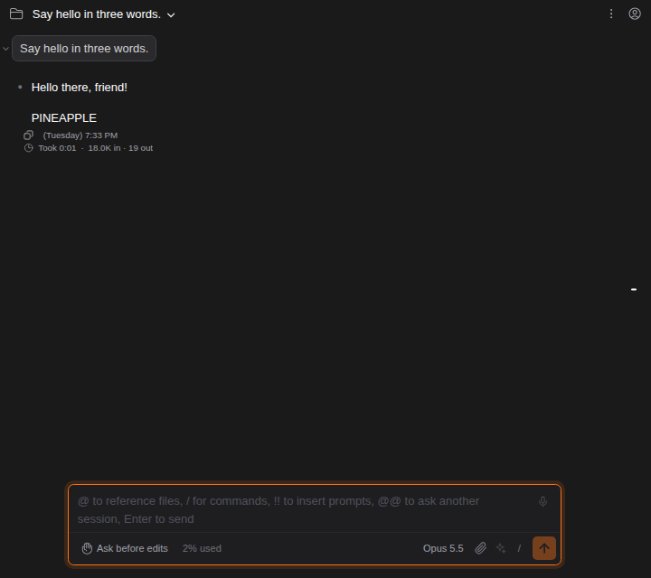
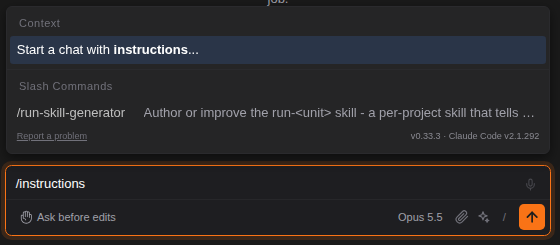
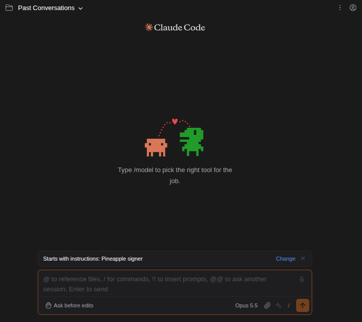

# Start a chat with instructions of your own

> Language: **English** · [한국어](./ko.md)

Some conversations need Claude to work a certain way from the first word: review like a strict senior engineer, answer in Korean, never touch the tests. Save that once as a prompt in the [Prompt Library](../064-prompt_library/en.md), then start a new chat with it as the conversation's **instructions**. Claude follows them for the whole conversation, on top of its usual instructions. Ported from the CC GUI plugin's agents, which are saved system prompts a chat runs with.

## How to use it

1. Write the instructions as a prompt in the Prompt Library, if you have not yet (slash panel → **Prompt Library**).
2. Type `/` and pick **Start a chat with instructions...** in the Context section (typing `/instructions` finds it).

   

3. Pick the prompt. The list holds the library's prompts that this project can use: your global ones and this project's own. Type to filter by name or text.

   

4. Above the input box you see which instructions the chat will start with. **Change** picks another, **×** goes back to none.

   

5. Send your first message. The conversation starts with those instructions.

If you are in a conversation that has already started, **Start a chat with instructions...** first leaves it for a new chat, the same way `/clear` does (and asks first, if you turned on [Ask before a new conversation](../099-ask_before_new_conversation/en.md)). The conversation you leave stays in the session list.

## Why only when a chat starts

Claude Code sets a conversation's system prompt when the conversation begins and keeps it. Measured with Claude Code 2.1.291: a conversation resumed without the instructions still followed them, and one resumed with different instructions kept the first ones. So the chat offers the choice where it takes effect, before the first message, and the line above the input box goes away once the conversation has started.

The same rule works in your favor afterwards: the instructions stay with the conversation through everything that restarts Claude Code behind the scenes (a change of permission mode or effort, reopening the conversation tomorrow, a fork), without the chat having to remember anything.

## How it works

It is Claude Code's own option, the one a terminal user passes as `claude --append-system-prompt-file <file>`. The chat writes the prompt's text to a private temporary file, starts Claude Code with that flag for the first message, and removes the file when that Claude Code process ends. The text goes in a file rather than on the command line, so nothing in it can be split or lost on the way (Windows passes command-line arguments without quotes).

The prompt is looked up when you send, so what Claude gets is what is saved in the library at that moment. If the prompt was deleted in the meantime, the conversation starts without instructions rather than losing your message.

## Common questions

**Can I change the instructions of a conversation that has started?** No; Claude Code keeps the ones it started with (see above). Start a new chat with the other prompt.

**Where are the instructions saved?** In the Prompt Library only. The conversation itself does not store which prompt it started with, so the line above the input box does not come back when you reopen it; Claude still follows the instructions.

**Does it replace Claude's own instructions or my CLAUDE.md?** No. Claude Code adds the prompt to its usual system prompt; `CLAUDE.md`, skills and settings apply as before.

**How do I move my instructions to another computer?** Export the Prompt Library and import it there.

## Limits

- Only a conversation started by sending a message takes the instructions. If the first thing you send is a command Claude Code runs on its own (such as `/btw`), the choice is dropped once that command starts the session.
- One prompt per conversation.
