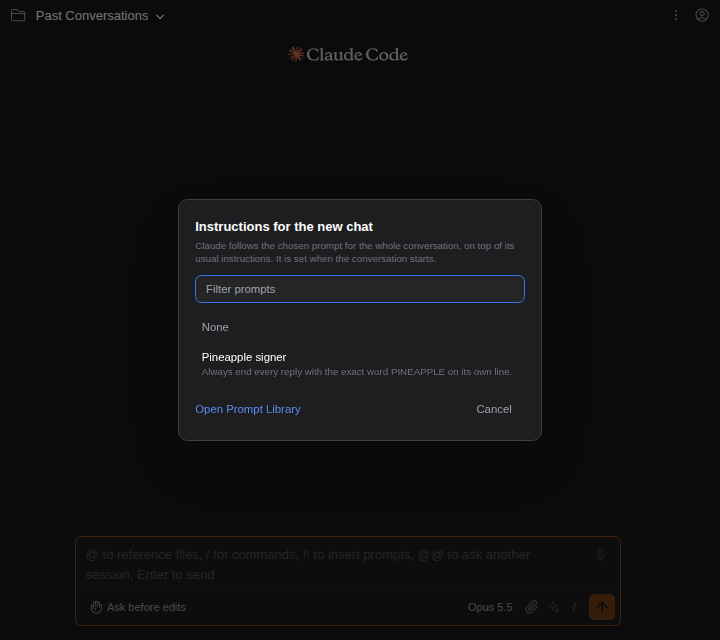

# 내 지침으로 채팅 시작하기

> Language: [English](./en.md) · **한국어**

어떤 대화는 첫마디부터 Claude가 특정한 방식으로 일해야 합니다. 깐깐한 시니어 엔지니어처럼 리뷰하기, 한국어로 답하기, 테스트는 건드리지 않기 같은 것입니다. 이것을 [프롬프트 라이브러리](../064-prompt_library/ko.md)에 한 번 저장해 두고, 그 프롬프트를 대화의 **지침**으로 삼아 새 채팅을 시작하세요. Claude는 평소 지침에 더해 대화 내내 그것을 따릅니다. CC GUI 플러그인의 에이전트(채팅이 함께 쓰는 저장된 시스템 프롬프트)에서 가져왔습니다.

## 쓰는 법

1. 아직 없다면 지침을 프롬프트 라이브러리에 프롬프트로 적어 둡니다(슬래시 패널 → **Prompt Library**).
2. `/`를 치고 Context 섹션의 **Start a chat with instructions...**를 고릅니다(`/instructions`로 찾을 수 있습니다).

   

3. 프롬프트를 고릅니다. 목록에는 이 프로젝트에서 쓸 수 있는 라이브러리 프롬프트, 즉 전역 프롬프트와 이 프로젝트의 프롬프트가 있습니다. 글자를 치면 이름이나 내용으로 좁혀집니다.

   

4. 입력창 위에 이 채팅이 어떤 지침으로 시작할지 보입니다. **Change**로 다른 것을 고르고, **×**로 지침 없이 되돌립니다.

   

5. 첫 메시지를 보냅니다. 대화가 그 지침으로 시작합니다.

이미 시작된 대화에서 **Start a chat with instructions...**를 고르면 `/clear`와 같은 방식으로 먼저 새 채팅으로 넘어갑니다([새 대화 전에 묻기](../099-ask_before_new_conversation/ko.md)를 켰다면 먼저 묻습니다). 떠난 대화는 세션 목록에 남습니다.

## 왜 채팅을 시작할 때만인가

Claude Code는 대화가 시작될 때 그 대화의 시스템 프롬프트를 정하고 계속 유지합니다. Claude Code 2.1.291로 확인했습니다. 지침 없이 다시 이어 간 대화도 그 지침을 따랐고, 다른 지침으로 이어 간 대화는 처음 지침을 그대로 썼습니다. 그래서 채팅은 선택이 효력을 갖는 자리, 즉 첫 메시지 전에만 고르게 하고, 대화가 시작되면 입력창 위의 줄은 사라집니다.

이 규칙은 그 뒤로는 도움이 됩니다. 권한 모드나 effort를 바꾸거나, 내일 대화를 다시 열거나, 포크하는 등 뒤에서 Claude Code가 다시 시작되어도 지침은 대화와 함께 갑니다. 채팅이 따로 기억할 것이 없습니다.

## 어떻게 동작하나

터미널 사용자가 `claude --append-system-prompt-file <파일>`로 넘기는 것과 같은 Claude Code 자신의 옵션입니다. 채팅은 프롬프트 내용을 나만 읽을 수 있는 임시 파일에 적고, 첫 메시지에서 그 옵션으로 Claude Code를 시작하며, 그 Claude Code 프로세스가 끝나면 파일을 지웁니다. 글을 명령줄이 아니라 파일로 넘기므로 중간에 쪼개지거나 사라지지 않습니다(Windows는 명령줄 인자를 따옴표 없이 넘깁니다).

프롬프트는 보내는 순간 찾으므로, Claude가 받는 것은 그때 라이브러리에 저장된 내용입니다. 그 사이 프롬프트가 지워졌다면 메시지를 잃지 않고 지침 없이 대화를 시작합니다.

## 자주 묻는 질문

**이미 시작된 대화의 지침을 바꿀 수 있나요?** 아니요. Claude Code가 처음 지침을 유지합니다(위 참조). 다른 프롬프트로 새 채팅을 시작하세요.

**지침은 어디에 저장되나요?** 프롬프트 라이브러리에만 있습니다. 대화는 어떤 프롬프트로 시작했는지 따로 기록하지 않아서, 다시 열면 입력창 위의 줄은 나오지 않습니다. Claude는 여전히 지침을 따릅니다.

**Claude의 기본 지침이나 CLAUDE.md를 대신하나요?** 아니요. Claude Code는 프롬프트를 평소 시스템 프롬프트에 덧붙입니다. `CLAUDE.md`, 스킬, 설정은 전과 같이 적용됩니다.

**지침을 다른 컴퓨터로 옮기려면?** 프롬프트 라이브러리를 내보내고 그곳에서 불러오세요.

## 한계

- 메시지를 보내서 시작한 대화만 지침을 받습니다. 처음 보내는 것이 Claude Code가 직접 실행하는 명령(`/btw` 등)이면, 그 명령이 세션을 만드는 순간 선택은 사라집니다.
- 대화마다 프롬프트 하나입니다.
