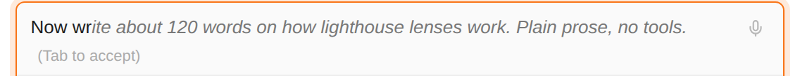
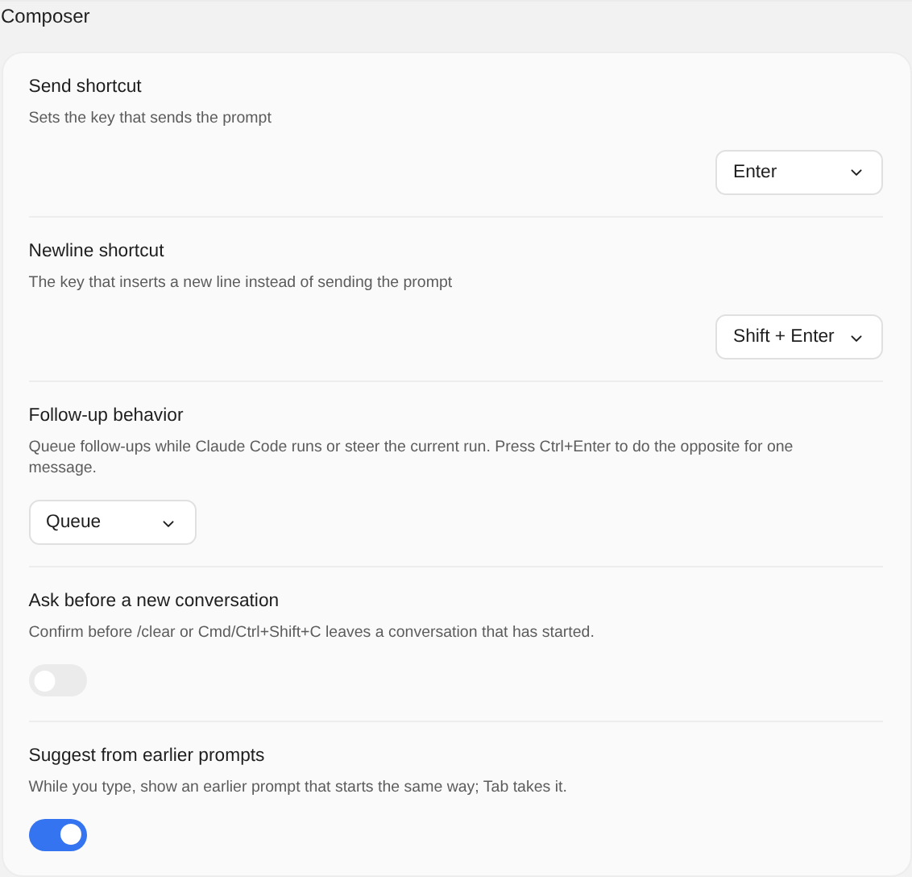

# Earlier prompts from your other conversations, and suggestions as you type

> Language: **English** · [한국어](./ko.md)

Two things for the composer, ported from the CC GUI plugin's input history:

- **Up keeps going past the conversation you are in**, into this project's other conversations, the way Up does in the Claude Code CLI. In a new chat, Up starts with what you typed last in your previous conversation.
- **As you type, an earlier prompt that starts the same way appears after the caret** in grey. Press **Tab** to take it, or keep typing to ignore it.

## Up goes on into your other conversations

[Up and Down walk the prompts you typed](../053-prompt_history_in_the_composer/en.md) in the conversation you are in. That has not changed, and it still comes first. What is new is what happens once you have walked past the first prompt of this conversation, where Up used to stop:

1. **This conversation**, from your newest prompt back, as before.
2. **Then this project's other conversations**, the most recently active first, by the same measure the Past Conversations list sorts by, each from its newest prompt back.

A prompt that is already in the list is skipped further on, so a "continue" or "yes" you typed in many conversations comes up once rather than once per conversation.

In a **new chat** there is no conversation of its own yet, so the first Up brings back the last thing you typed in your previous conversation:

Nothing is sent: a recalled prompt is only put into the input, for you to send, change or leave. Down walks back towards the newest and, past it, gives you back what you were typing.

The prompts are loaded twenty at a time as you walk back, so a project with hundreds of conversations costs no more to open than one with a few.

**Why it changed.** The CLI's own Up works this way: start a new session in a terminal and Up still finds what you typed in the last one. This chat used to stop at the edge of the conversation on purpose, on the view that a line from a conversation you are not looking at would surprise more than help. It now follows the CLI, which is the rule this chat is built on, and the other conversations only come after this one's own prompts, where Up used to do nothing.

## Suggestions as you type

Once you have typed two characters, the chat looks for the most recent earlier prompt that starts with what you typed and shows the rest of it after your text, in grey, with **(Tab to accept)**:

- **Tab** takes it, when the caret is at the end of your text where the suggestion is. Elsewhere Tab does what it always does.
- **Undo** (Ctrl+Z, Cmd+Z on macOS) right after Tab gives you back what you had typed.
- **Typing on** keeps your own text; the suggestion follows what you type, or goes away when nothing fits.

What counts as a match:

- **The start of a prompt**, ignoring capitals: "say th" finds "Say thanks in two words." What you typed stays as you typed it, and only the rest is added.
- **The most recent prompt wins**, in the same order Up walks: this conversation first, then the others.
- **Only prompts longer than what you typed.** A prompt you have typed in full suggests nothing.

A long prompt is previewed up to its first line break, and at most 120 characters, ending in "…" where it was cut. **Tab still puts in the whole prompt**, every line of it. The input grows to show the preview and shrinks back when it goes.

There is no suggestion:

- while a panel that uses Tab is open (the slash panel, @ mentions, the Prompt Library);
- while you are walking the history with Up and Down;
- after `/rename `, where the input suggests the conversation's current title instead.

## Turning suggestions off

**Settings → General → Composer → Suggest from earlier prompts** (GUI setting `suggestFromHistory`). It is on by default, as in CC GUI. Turning it off removes only the grey suggestion; Up still reaches your other conversations.

With it off, the same text shows nothing after it:

## Where the history comes from

From your conversations themselves: the transcripts Claude Code writes in its project folder. The chat keeps no list of its own, so there is nothing to clear or edit separately. Delete a conversation and its prompts leave the history with it.

That also means prompts you typed into Claude Code in a terminal, in this same project, are there too.

The CLI keeps a history file of its own (`~/.claude/history.jsonl`), but only of what is typed into its interactive prompt. What this chat sends reaches Claude Code as streamed input and is not added to that file (measured: no such file after hundreds of messages sent from the chat), so the transcripts are the source that holds both.

Only what a person typed is offered, by the same rules as in [053](../053-prompt_history_in_the_composer/en.md): Claude Code's own entries, command output, interrupt markers and notifications are left out, and so are slash commands.

With suggestions on, the chat loads your newest 100 or so prompts in the background, five pages of twenty, so there is something to suggest from as soon as you type. Walking back further with Up loads more, and suggestions draw on those too.

## Limits

- **Only this project's own folder.** Conversations from other projects are not included, and neither are conversations started in a subfolder, even when the conversation list shows them alongside.
- **Suggestions match the start of a prompt only**, not a word in the middle of one. CC GUI also suggests pieces of earlier prompts split at punctuation; here a suggestion is always a whole earlier prompt.
- **Conversations are walked one after another**, each from its newest prompt back, rather than mixed by the time each prompt was typed. Two conversations you worked in at the same time come up one after the other.
- **Slash commands are not suggested or recalled**, as before: the transcript stores the command's expansion rather than what you typed.
