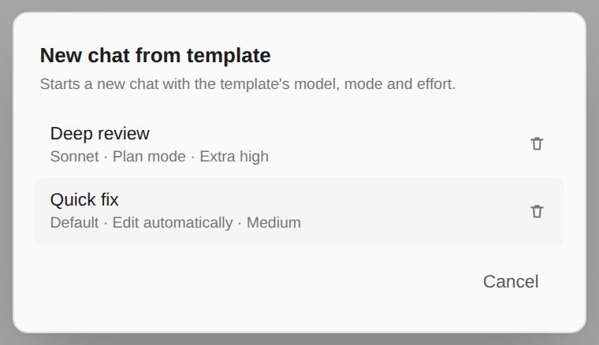
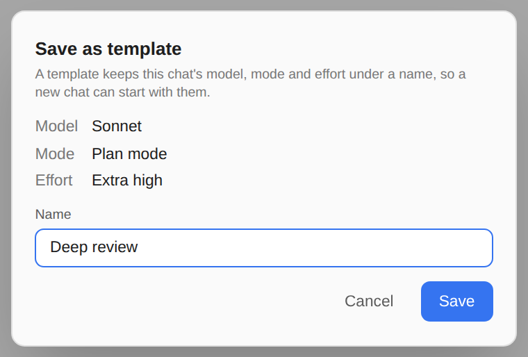
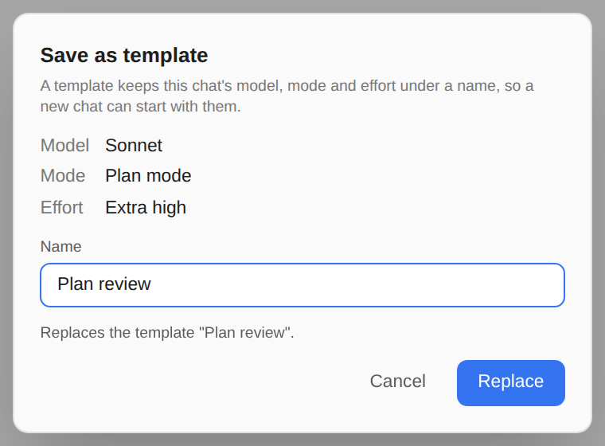

# Session templates

> Language: **English** · [한국어](./ko.md)

If you start some chats in Plan mode on one model at a high effort, and others with edits allowed at a low one, a template saves setting the three by hand each time. Save the chat's **model, mode and effort** under a name, and start a new chat with them in one pick. Ported from the CC GUI plugin's "Save as Template" and "Create from Template".

## Saving a template

1. Set the chat up the way you want new ones to start: the model in the model menu, the mode and the effort in the mode menu.
2. Type `/` and pick **Save as template...** in the Context section (typing `/template` finds it).
3. The dialog shows what will be kept. Give it a name and press **Save** or Enter.

A name you already used replaces that template. The dialog says so before you save, and the button reads **Replace**:

The choices are saved as the chat holds them. "Default" is the model menu's **Default (recommended)**, and stays the default rather than whichever model that is today. With **Ultracode** on, the template keeps Ultracode rather than the Extra high it runs at.

## Starting a chat from one

Type `/` and pick **New chat from template...** (also found by `/template`), then click a template.

- **In a chat that has started**, picking a template leaves it for a new chat in the same tab, as `/clear` does, and asks first when [Ask before a new conversation](../099-ask_before_new_conversation/en.md) is on. Say no and nothing changes.
- **In a new chat**, the choices are only set; there is nothing to leave.

The template's model is chosen first, then its mode and its effort, each the way you would choose it in the composer. So the model and the effort are your Claude Code settings (`model` and `effortLevel` in `~/.claude/settings.json`) and stay for the chats after this one too, exactly as when you pick them by hand. The mode belongs to this chat.

A mode this chat does not offer is skipped rather than forced: a template saved in **Bypass permissions** does not turn it on where bypass is not available. The rest of the template still applies.

## Deleting a template

Open **New chat from template...** and click the bin next to a template. The chat asks before it deletes. Opening the dialog just to look or delete starts nothing; **Cancel** or Escape closes it.

## Where templates are kept

In your GUI data folder (`~/.claude-code-gui`, table `session_templates`), with your other GUI data. A template is a preset of this GUI, not anything of Claude Code's, so the CLI has no command for it and does not see it. Templates are the same in every project.

## How it differs from CC GUI

- **No working directory or provider.** CC GUI's template also keeps the folder the session runs in and the AI provider. A chat here always runs in the project it is opened in, and Claude is the only provider.
- **In the slash panel rather than the IDE's menu.** CC GUI offers both through IDE actions; here they are in the slash panel, so they work the same in a browser and in the IDE.
