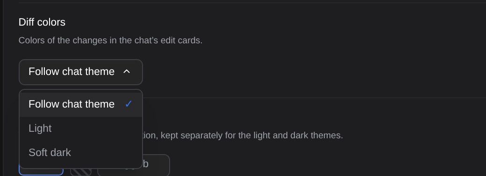
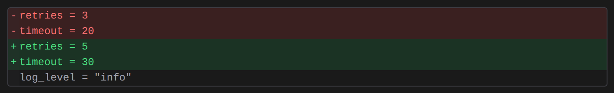
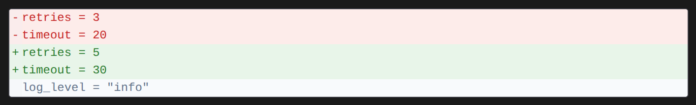
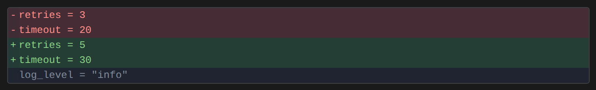

# Diff 색

> Language: [English](./en.md) · **한국어**

채팅의 편집 카드는 변경을 채팅 테마의 색으로 빨간 줄과 초록 줄로 보여 줍니다. 그 색이 눈에 부담되거나, 채팅 테마와 상관없이 diff를 늘 같은 모양으로 보고 싶다면 색을 직접 고를 수 있습니다. CC GUI 플러그인의 "Diff Theme"에서 가져왔습니다.

## 색 고르기

**설정 → 모양 → 채팅 → Diff 색**:

| 선택 | diff 모양 |
|---|---|
| **채팅 테마 따르기**(기본) | 채팅 테마의 diff 색. 이 설정이 생기기 전과 똑같습니다. |
| **IDE 테마 따르기** | IDE 테마가 밝으면 밝게, 어두우면 어둡게. 채팅 테마와 상관없습니다. IDE 안에서만 나옵니다. |
| **라이트** | 늘 밝은 배경에 초록·빨간 줄. |
| **부드러운 다크** | 늘 검정보다 부드러운 짙은 청회색 배경에 덜 쨍한 초록·빨강. |

다크 테마에서 채팅 테마 따르기:

같은 다크 채팅에서 라이트:

부드러운 다크:

바꾸면 바로, 채팅에 이미 있는 모든 편집 카드에 적용됩니다. 채팅의 나머지는 테마를 그대로 따릅니다.

## 세부 사항

- **IDE 테마 따르기**는 IDE 테마가 밝은지 어두운지만 읽고, IDE 테마를 바꾸면 따라 바뀝니다. 채팅 테마를 라이트나 다크로 따로 정해 두고 diff만 옆의 에디터와 맞추고 싶을 때 씁니다. 브라우저에는 따를 IDE 테마가 없어 이 선택이 나오지 않으며, IDE에서 고른 값은 브라우저에서 채팅 테마 따르기로 보이고 그렇게 동작합니다.
- 다른 모양 설정처럼 프로젝트 설정에서 프로젝트 하나에만 정할 수 있습니다.
- 바꾸는 것은 색뿐입니다. 카드가 펼쳐진 채 시작할지는 [Expand diffs](../100-expand_diffs_switch/ko.md), 긴 줄 접기는 [자동 줄바꿈](../036-soft_wrap/ko.md)입니다.

## 적용되지 않는 곳

- **편집을 적용하기 전의 diff 검토**(IDE의 diff 창, 또는 브라우저의 검토 페이지)는 자기 색을 씁니다. IDE 쪽은 IDE 테마가, 브라우저 페이지는 구문 강조가 정합니다.
- **답변 속 코드 블록**은 diff가 아니라서 채팅 테마를 따릅니다.
