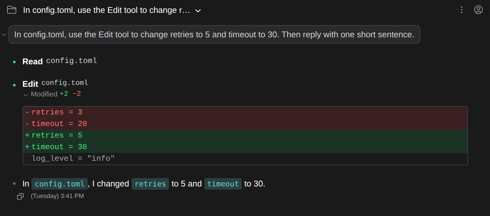
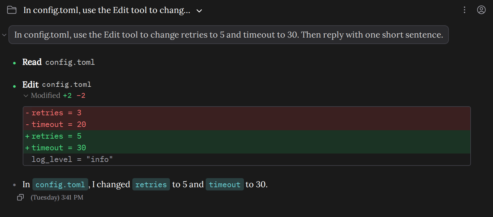
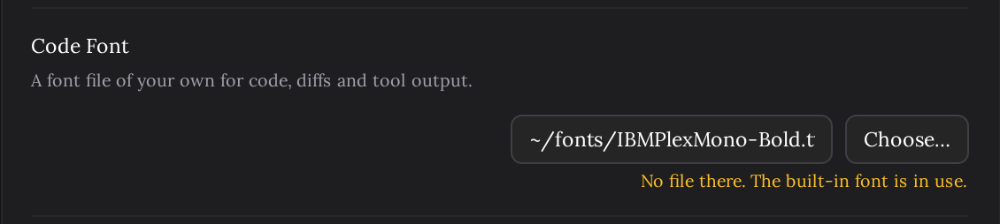

# Font files of your own

> Language: **English** · [한국어](./ko.md)

The interface's text and the code in the chat use built-in fonts: your system's sans-serif for text, and a monospace stack for code. If you would rather read them in a font of your own, such as a favorite programming font or one that covers your language better, point the plugin at the font's file. Ported from the CC GUI plugin's custom UI and code font files.

## Choosing the fonts

**Settings → Appearance → Text Font** and **Code Font**. Write the path of a font file, or press **Choose…** and pick it. The path is saved when you leave the field, and the font takes effect at once. Leave the field empty for the built-in font.

| Setting | What it changes |
|---|---|
| **Text Font** | All the interface's text: your messages, Claude's replies, the composer, menus and the settings screen. |
| **Code Font** | Code: code blocks and `inline code` in replies, the edit cards' diffs, commands and tool input and output, file names in tool rows. |

The same conversation with the built-in fonts:

And with a serif text font and a different code font:

## Which files work

- **Formats**: `.ttf`, `.otf`, `.woff` and `.woff2`. A font collection (`.ttc`) holds several fonts in one file and is not accepted; use a single font from the family instead.
- **A full path**: starting with `/`, with `~` for your home folder (`~/fonts/Mono.ttf`), or with a drive letter on Windows (`C:\Users\me\Fonts\Mono.ttf`). A relative path is refused, because there is no telling what it would be relative to.
- **Up to 32 MB.** Large fonts for Chinese, Japanese or Korean run to about 20 MB and fit.
- **Fonts installed on your system are files too.** You will find them in `~/Library/Fonts` or `/Library/Fonts` on macOS, `C:\Windows\Fonts` (or `%LOCALAPPDATA%\Microsoft\Windows\Fonts` for fonts installed for one user) on Windows, and `~/.local/share/fonts` or `/usr/share/fonts` on Linux. **Choose…** opens a file picker (the IDE's inside the IDE, your system's in a browser), so you can browse there.

## When a file cannot be used

The reason shows in yellow under the field, and the built-in font stays in place, so the chat is never left without a font.

| Message | What happened |
|---|---|
| Write the full path, starting with / or ~ (or a drive letter). | A relative path. It is not saved. |
| Choose a .ttf, .otf, .woff or .woff2 file. | Another kind of file. It is not saved. |
| No file there. The built-in font is in use. | Nothing at that path, often a file that was moved, renamed or deleted after you chose it. |
| The file is over 32 MB. The built-in font is in use. | Too large to load. |
| The file could not be read. The built-in font is in use. | The file is there but cannot be opened, usually because of its permissions. |
| This file is not a font that can be used. The built-in font is in use. | It has a font's name but its contents are not a font the browser can read, or it is damaged. |
| The font could not be loaded. The built-in font is in use. | The plugin's backend did not answer, for example while it was restarting. It tries again when the connection comes back; if the message stays, reopen the chat tab. |

## Details

- **One file is one style.** Bold and italic text is drawn from that same file by the browser, which thickens or slants it, rather than from the family's bold or italic file.
- **Characters the font lacks** come from the built-in font. A Latin-only font shows Korean, Chinese or emoji in the built-in font, in the same line.
- **The path is a path on the computer running the plugin.** The plugin reads the file there and hands it to the chat, so a chat opened from your phone through the tunnel shows the same font, from the file on your computer.
- **Replacing the file under the same name** shows in a chat opened afterwards. A chat that is already open keeps the version it loaded until you reopen it.
- Like the other Appearance settings, the fonts can be set for one project in **Project Settings (Local)**.
- The text size is **Font Size**, just above these rows, and the space between lines is [Line Spacing](../014-line_spacing/en.md).

## What it does not do

- **It does not follow the IDE's fonts.** The built-in fonts are the chat's own, as before this setting. To match the editor, choose the editor font's file as the Code Font.
- **It does not list installed fonts by name.** You choose a file. This is how CC GUI does it too.
- **The IDE's own diff viewer**, where an edit can be reviewed before it is applied, uses the IDE's editor font, which the IDE sets.
