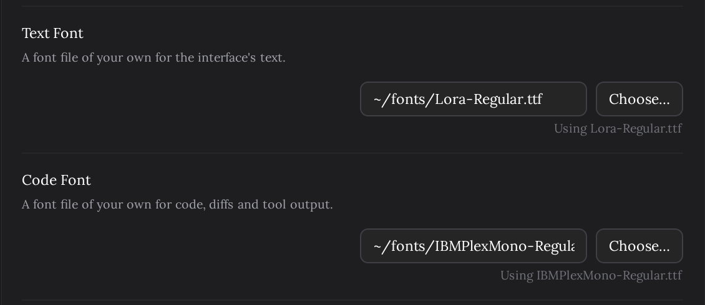

# 나만의 글꼴 파일

> Language: [English](./en.md) · **한국어**

화면의 글자와 채팅 속 코드는 기본 글꼴로 그려집니다. 글자는 시스템의 산세리프, 코드는 고정폭 글꼴 묶음입니다. 아끼는 프로그래밍 글꼴이나 내 언어를 더 잘 담는 글꼴로 읽고 싶다면 그 글꼴 파일을 지정하세요. CC GUI 플러그인의 사용자 UI·코드 글꼴 파일 기능을 가져왔습니다.

## 글꼴 고르기

**설정 → 모양 → Text Font**와 **Code Font**. 글꼴 파일의 경로를 적거나 **Choose…**를 눌러 고릅니다. 칸을 벗어나면 저장되고 글꼴은 바로 바뀝니다. 칸을 비우면 기본 글꼴로 돌아갑니다.

| 설정 | 바뀌는 곳 |
|---|---|
| **Text Font** | 화면의 모든 글자: 내 메시지, Claude의 답변, 입력창, 메뉴, 설정 화면. |
| **Code Font** | 코드: 답변 속 코드 블록과 `인라인 코드`, 편집 카드의 diff, 명령과 도구 입출력, 도구 줄의 파일 이름. |

기본 글꼴로 본 대화:

세리프 글자 글꼴과 다른 코드 글꼴로 본 같은 대화:

## 쓸 수 있는 파일

- **형식**: `.ttf`, `.otf`, `.woff`, `.woff2`. 글꼴 모음(`.ttc`)은 한 파일에 글꼴이 여럿 들어 있어 받지 않습니다. 그 패밀리의 단일 글꼴 파일을 쓰세요.
- **전체 경로**: `/`로 시작하거나, 홈 폴더를 `~`로 쓰거나(`~/fonts/Mono.ttf`), Windows에서는 드라이브 문자로 시작합니다(`C:\Users\me\Fonts\Mono.ttf`). 상대 경로는 무엇에 대한 상대인지 알 수 없어 받지 않습니다.
- **32MB까지.** 한중일 글꼴처럼 큰 것도 20MB 안팎이라 들어갑니다.
- **시스템에 설치한 글꼴도 파일입니다.** macOS는 `~/Library/Fonts`나 `/Library/Fonts`, Windows는 `C:\Windows\Fonts`(한 사용자에게만 설치했다면 `%LOCALAPPDATA%\Microsoft\Windows\Fonts`), Linux는 `~/.local/share/fonts`나 `/usr/share/fonts`에 있습니다. **Choose…**는 파일 선택 창(IDE 안에서는 IDE의 것, 브라우저에서는 시스템의 것)을 여니 거기서 찾아가면 됩니다.

## 파일을 쓸 수 없을 때

칸 아래에 이유가 노란 글씨로 나오고 기본 글꼴이 그대로 쓰이므로, 채팅에 글꼴이 없어지는 일은 없습니다.

| 메시지 | 무슨 일인지 |
|---|---|
| Write the full path, starting with / or ~ (or a drive letter). | 상대 경로입니다. 저장하지 않습니다. |
| Choose a .ttf, .otf, .woff or .woff2 file. | 다른 종류의 파일입니다. 저장하지 않습니다. |
| No file there. The built-in font is in use. | 그 경로에 아무것도 없습니다. 고른 뒤에 파일을 옮기거나 이름을 바꾸거나 지운 경우가 많습니다. |
| The file is over 32 MB. The built-in font is in use. | 불러오기엔 너무 큽니다. |
| The file could not be read. The built-in font is in use. | 파일은 있지만 열 수 없습니다. 대개 권한 때문입니다. |
| This file is not a font that can be used. The built-in font is in use. | 이름은 글꼴인데 내용이 브라우저가 읽을 수 있는 글꼴이 아니거나 손상됐습니다. |
| The font could not be loaded. The built-in font is in use. | 플러그인 백엔드가 응답하지 않았습니다(재시작 중 등). 연결이 돌아오면 다시 시도하고, 메시지가 남아 있으면 채팅 탭을 다시 여세요. |

## 세부 사항

- **파일 하나는 스타일 하나입니다.** 굵은 글씨와 기울임은 그 패밀리의 Bold·Italic 파일이 아니라, 같은 파일을 브라우저가 두껍게·기울여 그립니다.
- **글꼴에 없는 글자**는 기본 글꼴로 나옵니다. 라틴 문자만 있는 글꼴이면 한글·한자·이모지는 같은 줄에서 기본 글꼴로 보입니다.
- **경로는 플러그인이 돌아가는 컴퓨터의 경로입니다.** 플러그인이 그 컴퓨터에서 파일을 읽어 채팅에 넘기므로, 터널로 휴대폰에서 연 채팅도 컴퓨터의 파일로 같은 글꼴을 보여 줍니다.
- **같은 이름으로 파일을 바꿔 넣으면** 그 뒤에 연 채팅부터 반영됩니다. 이미 열려 있는 채팅은 다시 열 때까지 불러 둔 판을 씁니다.
- 다른 모양 설정처럼 **Project Settings (Local)**에서 프로젝트 하나에만 정할 수 있습니다.
- 글자 크기는 바로 위의 **Font Size**, 줄 간격은 [줄 간격](../014-line_spacing/ko.md)입니다.

## 하지 않는 것

- **IDE의 글꼴을 따르지 않습니다.** 기본 글꼴은 이 설정이 생기기 전과 같은 채팅 자체의 글꼴입니다. 에디터와 맞추고 싶다면 에디터 글꼴의 파일을 Code Font로 고르세요.
- **설치된 글꼴을 이름으로 보여 주지 않습니다.** 파일을 고릅니다. CC GUI도 같은 방식입니다.
- **IDE의 diff 창**(편집을 적용하기 전에 검토하는 곳)은 IDE가 정하는 에디터 글꼴을 씁니다.
