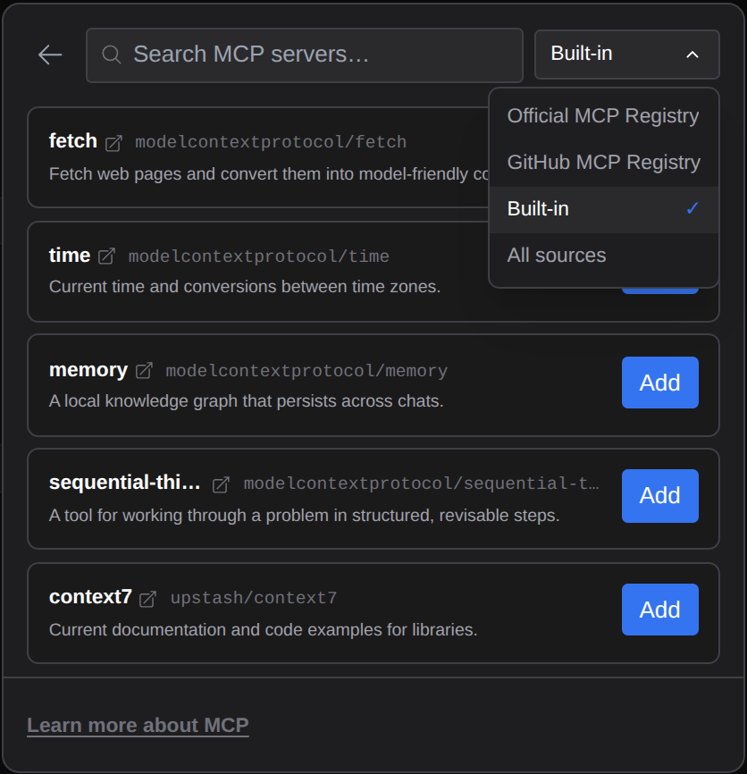
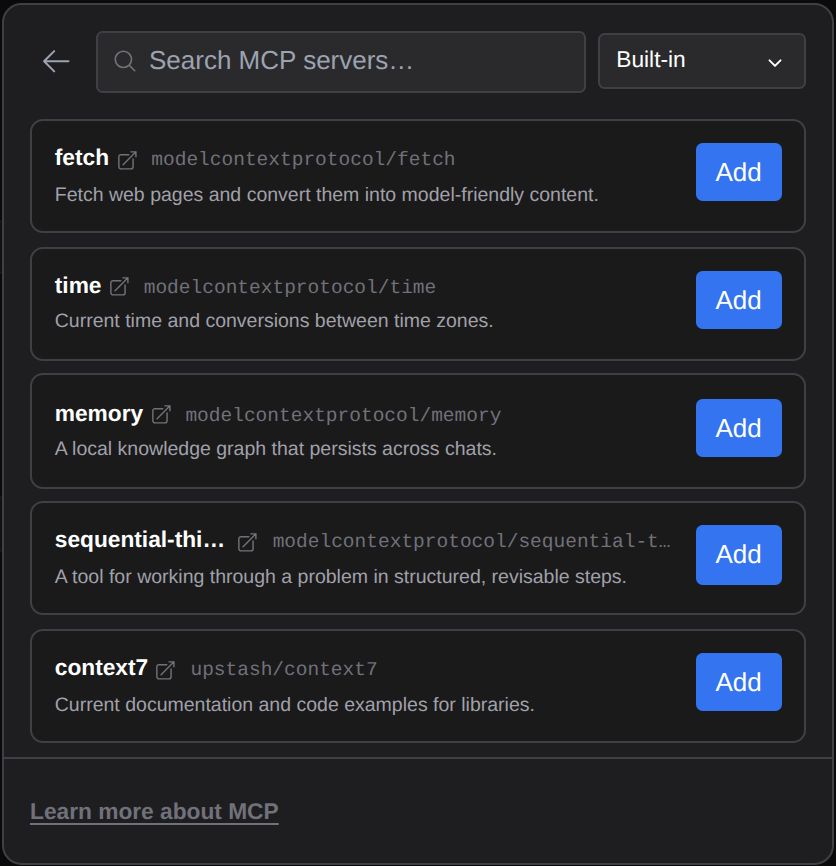
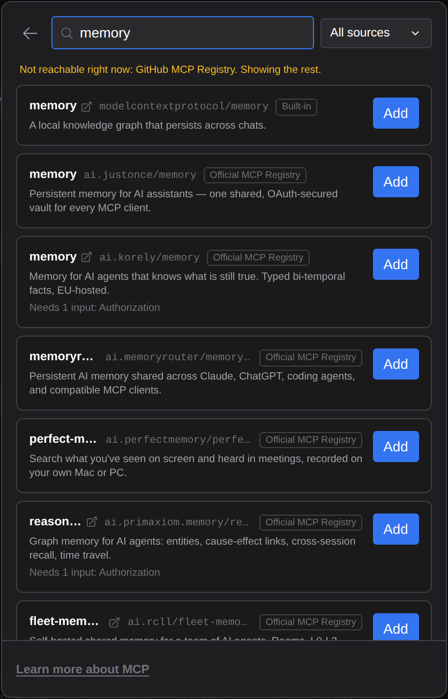

# MCP 서버를 찾을 곳이 늘었습니다

> Language: [English](./en.md) · **한국어**

MCP 서버 창의 레지스트리 브라우저(창 머리의 검색 아이콘, [MCP 서버 관리](../003-mcp_server_management/ko.md) 참고)는 카탈로그 하나, 공식 MCP 레지스트리만 검색했습니다. 이제 **GitHub의 MCP 레지스트리**, 잘 알려진 서버를 모은 짧은 **기본 제공** 목록, 또는 **이 모두를 한꺼번에** 검색할 수 있습니다. CC GUI 플러그인의 MCP 마켓플레이스 출처를 가져왔습니다.

## 카탈로그 고르기

검색칸 옆 드롭다운이 어디를 볼지 정합니다:

| 카탈로그 | 무엇인지 | 검색 방식 |
|---|---|---|
| **Official MCP Registry**(기본) | registry.modelcontextprotocol.io의 커뮤니티 레지스트리. 이전과 같습니다. | 입력하는 대로 레지스트리가 이름으로 검색합니다. |
| **GitHub MCP Registry** | GitHub이 운영하는 같은 종류의 레지스트리. | 플러그인이 서버를 500개까지 읽어 한 시간 보관하고, 이름과 설명을 직접 검색합니다. |
| **Built-in** | 플러그인이 보여 주는 잘 알려진 서버 다섯: fetch, time, memory, sequential-thinking, context7. | 고르자마자 나오고, 입력하면 좁혀집니다. |
| **All sources** | 위 셋을 함께. | 서버마다 한 번씩, 기본 제공 → 공식 레지스트리 → GitHub 순. 카드마다 어느 카탈로그인지 태그가 붙습니다. |

고른 카탈로그는 다음에 브라우저를 열 때도 유지됩니다.

## 기본 제공 서버

| 서버 | 실행 명령 | 하는 일 |
|---|---|---|
| fetch | `uvx mcp-server-fetch` | 웹 페이지를 가져와 Claude가 읽을 수 있는 글로 바꿉니다. |
| time | `uvx mcp-server-time` | 현재 시각을 알려 주고 시간대 사이를 변환합니다. |
| memory | `npx -y @modelcontextprotocol/server-memory` | 대화를 넘어 유지되는 지식 그래프를 내 컴퓨터에 둡니다. |
| sequential-thinking | `npx -y @modelcontextprotocol/server-sequential-thinking` | 문제를 고쳐 가며 단계별로 풀 도구를 Claude에게 줍니다. |
| context7 | `npx -y @upstash/context7-mcp` | 라이브러리의 최신 문서와 코드 예시를 찾아 줍니다. |

fetch와 time은 Python 패키지라 [uv](https://docs.astral.sh/uv/)에 딸린 **`uvx`**로 실행됩니다. uv가 없으면 이 둘은 시작되지 않습니다. 나머지는 Claude Code가 이미 쓰는 Node.js로 돕니다.

**Add**는 다른 레지스트리 서버와 같습니다. 서버 이름과 설정이 채워진 추가 폼이 열리고, 범위를 고른 뒤 추가합니다.

![fetch의 Add를 누른 뒤의 추가 폼: Name "fetch", Scope "User (all projects)", 설정 {"type": "stdio", "command": "uvx", "args": ["mcp-server-fetch"]}.](./assets/prefill.png)

## 카탈로그에 닿지 못할 때

카탈로그 하나만 검색하다 닿지 못하면 이전처럼 결과 자리에 오류가 나옵니다. **All sources**는 나머지가 찾은 것을 보여 주고, 빠진 카탈로그를 한 줄로 알려 줍니다:

플러그인은 자신이 도는 컴퓨터에서, 다른 요청처럼 프록시 설정을 거쳐 카탈로그에 접속합니다([프록시 뒤의 사용량](../063-usage_behind_a_proxy/ko.md)). 회사 네트워크가 호스트(`registry.modelcontextprotocol.io`, `api.mcp.github.com`) 중 하나를 막으면 그 카탈로그는 빠집니다.

## 하지 않는 것

- **`modelcontextprotocol` GitHub 조직 카탈로그는 없습니다.** CC GUI는 그 조직의 저장소도 보여 줍니다. 대부분 서버가 아니라 SDK, 명세, 도구이고 실행 방법도 없어서, 추가할 수 없는 카드가 될 뿐입니다. 그중 서버는 레지스트리에 있습니다.
- **GitHub 레지스트리는 플러그인이 읽은 서버 안에서 이름과 설명으로만 검색합니다.** 500개 뒤의 서버는 나오지 않습니다. 공식 레지스트리는 자체 검색이라 이런 제한이 없습니다.
- **추가는 여전히 `claude mcp add-json`으로 합니다.** 직접 붙여 넣은 서버와 똑같습니다. 카탈로그는 폼을 채울 뿐입니다.
