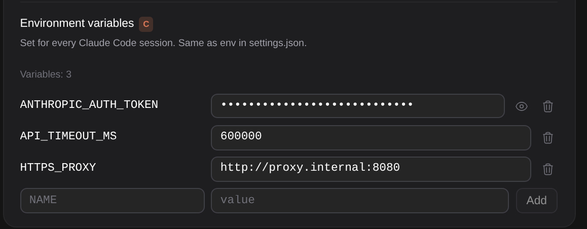

# Claude의 환경 변수를 설정에서

> Language: [English](./en.md) · **한국어**

Claude Code는 settings.json의 `env` 블록을 읽어 모든 세션에 그 변수를 설정합니다. 프록시, 요청 시간 제한, API 게이트웨이의 주소와 키, 기능 스위치 같은 것들입니다. 바꾸려면 편집기로 파일을 열어야 했습니다. 이제 **설정 → 일반 → Environment variables**가 목록을 보여 주고 추가·변경·삭제를 하며, CLI가 읽는 바로 그 파일에 씁니다. CC GUI 플러그인의 환경 변수 편집기를 가져왔습니다.

## 편집기

- **추가**: 이름과 값을 적고 **Add**, 또는 값 칸에서 Enter.
- **변경**: 값을 고치면 칸을 벗어날 때 저장됩니다.
- **삭제**: 변수 옆 휴지통 버튼.

값은 적은 그대로 글자로 저장됩니다. 빈 값도 값입니다. 변수가 빈 문자열로 설정되며, CLI도 `""`를 그렇게 다룹니다.

이름은 영문자·숫자·`_`이고 숫자로 시작할 수 없습니다. 프로세스가 담을 수 있는 이름이 그것뿐이라서입니다. 그 밖의 이름은 칸 아래에서 거절되고 아무것도 저장되지 않습니다.

**키는 가려집니다.** 이름이 `API_KEY`, `TOKEN`, `SECRET`, `PASSWORD`로 끝나는 변수는 점으로 보이고, 눈 버튼을 누르면 페이지를 떠날 때까지 보입니다.

## 어느 파일인가

| 탭 | 파일 |
|---|---|
| **User Settings (Global)** | 모든 프로젝트가 쓰는 `~/.claude/settings.json`(또는 `CLAUDE_CONFIG_DIR`이 가리키는 폴더). |
| **Project Settings (Local)** | 프로젝트의 `.claude/settings.json`. |

Claude Code는 각각 옆의 `settings.local.json`도 읽고, 편집기는 둘을 합쳐 보여 줍니다. 이미 `settings.local.json`에 있는 변수는 거기서 바뀌고, 새 변수는 `settings.json`에 들어갑니다. 삭제는 두 파일 모두에서 지웁니다. 두 파일의 다른 것은 건드리지 않습니다. 다른 설정과 다른 변수는 그대로이고, 읽을 수 없는 파일은 덮어쓰지 않고 오류로 남깁니다.

프로젝트의 `.claude/settings.json`은 보통 커밋되므로 프로젝트 탭은 목록 아래에서 그 사실을 알려 줍니다. API 키와 토큰은 User Settings 탭이나, 내 컴퓨터에만 두라고 있는 프로젝트의 `settings.local.json`에 두세요.

## 언제 적용되나

Claude Code는 시작할 때 파일을 읽으므로, 새 세션의 다음 메시지부터, 또는 실행 중인 세션이 다시 시작된 뒤부터 적용됩니다. 열린 채팅 탭과 설정 화면은 다른 설정처럼 바로 갱신됩니다.

## 하지 않는 것

- **글자·숫자·참거짓 값만 보여 줍니다.** 객체나 목록인 값(CLI가 쓰지 않음)은 파일에 그대로 두고 목록에 넣지 않습니다.
- **플러그인의 CLAUDE_CONFIG_DIR이 아닙니다.** 그 값은 이 파일들의 위치를 정하므로 그 안에 둘 수 없고, 일반 아래 [별도 줄](../069-settings_that_reach_everything/ko.md)이 있습니다.
- **셸에서 설정한 변수**는 파일에 없으니 나오지 않습니다. `env`의 변수가 셸에서 export한 같은 변수를 이깁니다. 터미널에서와 같습니다.
